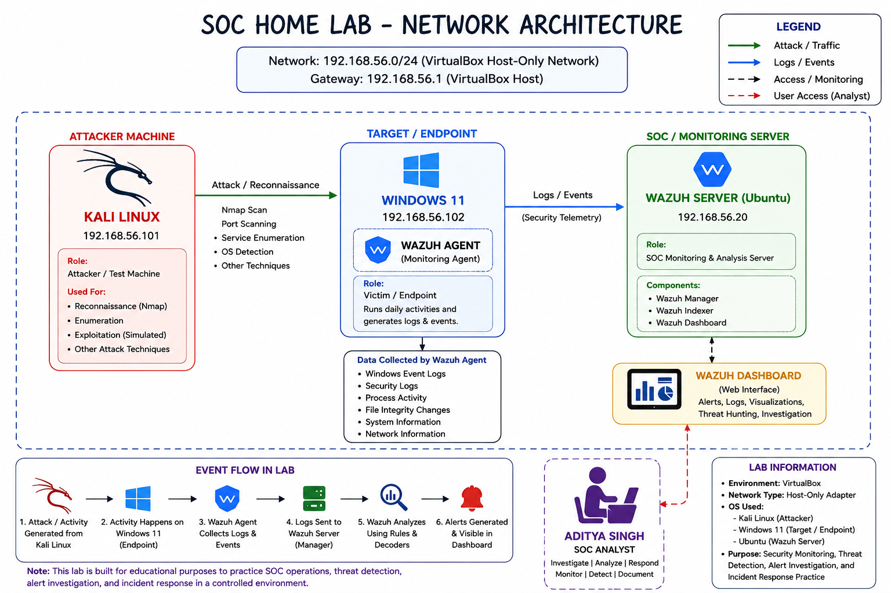

# 01 — Lab Architecture

## Overview

This section documents the architecture of my SOC Home Lab, including the virtual machines, network configuration, security monitoring flow, and role of each component.

## Lab Architecture

## Lab Components

| Machine | Role | IP Address |
|---|---|---|
| Kali Linux | Security testing / attacker machine | `192.168.56.101` |
| Windows 11 | Monitored endpoint | `192.168.56.102` |
| Ubuntu | Wazuh server / SOC monitoring | `192.168.56.20` |

## Network Configuration

- **Network:** `192.168.56.0/24`
- **Network Type:** VirtualBox Host-Only Network
- **Gateway:** `192.168.56.1`

## Security Monitoring Flow

Kali Linux
    |
    | Security Testing / Controlled Activity
    v
Windows 11
    |
    | Wazuh Agent
    | Logs & Security Events
    v
Ubuntu Wazuh Server
    |
    | Detection & Analysis
    v
Wazuh Dashboard
    |
    v
SOC Analyst Investigation

## Component Roles

### Kali Linux

Used as the security testing machine for reconnaissance and controlled security activities against the Windows endpoint.

### Windows 11

Acts as the monitored endpoint. The Wazuh Agent collects security telemetry, including Windows event logs and endpoint activity.

### Ubuntu — Wazuh Server

Acts as the central SOC monitoring and analysis server. It receives telemetry from the Windows endpoint and processes it using Wazuh.

### Wazuh Dashboard

Provides the interface for viewing alerts, logs, security events, visualizations, and investigation data.

## Documentation

For the detailed network flow and architecture documentation, see:

- [Network Diagram](./network-diagram.md)
