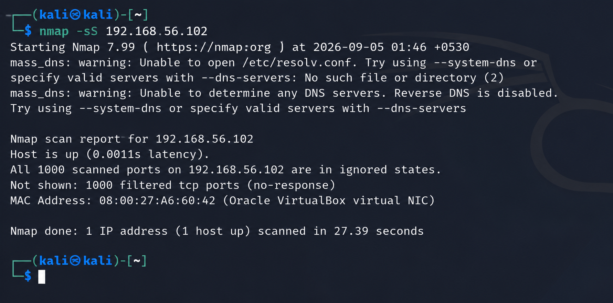
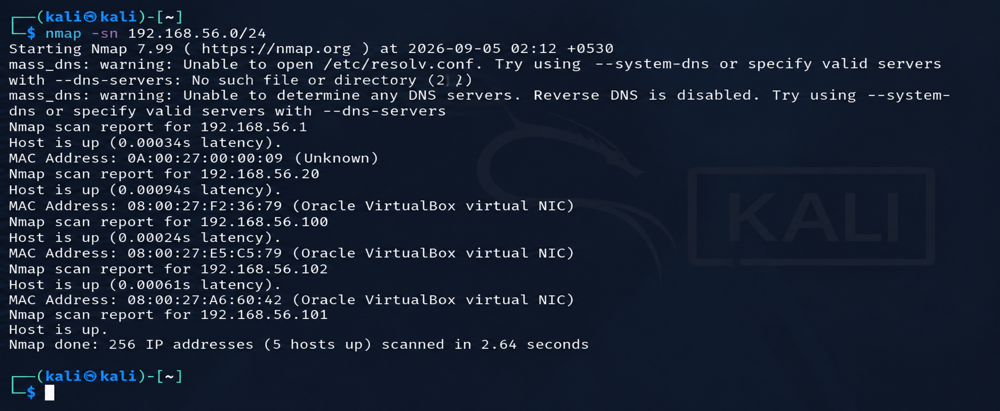
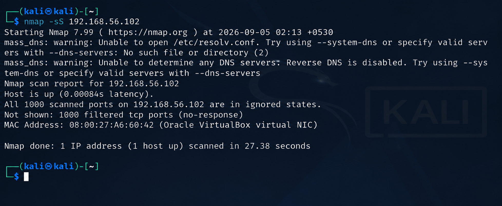
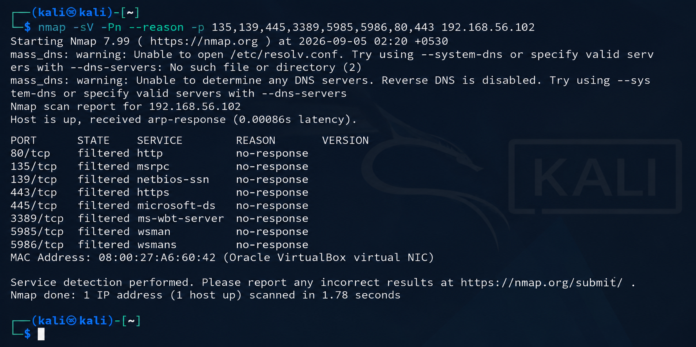

# 03 - Network Reconnaissance

In this part, I used Nmap from my Kali Linux machine to do some basic reconnaissance on my Windows test machine.

The target used for this lab was:

- Kali Linux: 192.168.56.101
- Windows test machine: 192.168.56.102

The main goal was to first find active hosts and then check what could be seen from the Kali machine.

---

## 1. Host Discovery

First, I checked which devices were active on the 192.168.56.0/24 network.

Command used:

nmap -sn 192.168.56.0/24

The scan found 5 active hosts:

- 192.168.56.1
- 192.168.56.20
- 192.168.56.100
- 192.168.56.101
- 192.168.56.102

My Windows test machine was 192.168.56.102.

Screenshot:

---

## 2. NULL Scan

I then tried a NULL scan against the network to see how the hosts responded without TCP flags being set.

Command used:

nmap -sN 192.168.56.0/24

For the Windows machine, the result showed the ports as open|filtered or filtered depending on the response.

This was useful for understanding that a normal port scan does not always give a simple open/closed answer, especially when a firewall is involved.

Screenshot:

---

## 3. SYN Scan

Next, I performed a SYN scan against the Windows machine.

Command used:

nmap -sS 192.168.56.102

The scan showed the host was up, but the 1000 scanned TCP ports were filtered and there was no response from them.

This was an important result because it showed that the Windows Firewall was stopping the connection attempts instead of simply showing the ports as closed.

Screenshot:

---

## 4. Service Detection

After that, I checked some commonly used Windows and web-related ports with service detection enabled.

Command used:

nmap -sV -Pn --reason -p 135,139,445,3389,5985,5986,80,443 192.168.56.102

The result was:

- 80/tcp - filtered
- 135/tcp - filtered
- 139/tcp - filtered
- 443/tcp - filtered
- 445/tcp - filtered
- 3389/tcp - filtered
- 5985/tcp - filtered
- 5986/tcp - filtered

No service versions were identified because the ports were filtered and did not respond.

Screenshot:

---

## What I learned

The main thing I learned from this part was that reconnaissance is not just about finding open ports.

The firewall itself gives useful information.

In this lab, the Windows machine was reachable, but its firewall was dropping the TCP connection attempts. I could see this from both the Nmap results and the Windows Firewall logs.

This also gave me a good example of how a SOC analyst can connect network activity with endpoint logs instead of looking at only one source.

---

## Lab Result

The basic reconnaissance flow I followed was:

Host Discovery → NULL Scan → SYN Scan → Service Detection

The scans were performed only against my own isolated VirtualBox lab environment.
