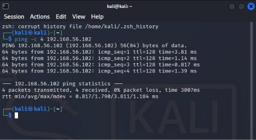
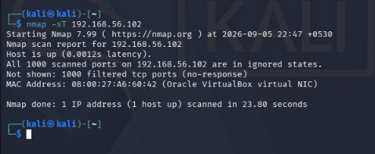
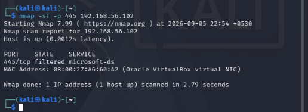
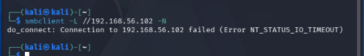

# 04 - Controlled Activity

In this part of the lab, I started generating some controlled activity on the Windows 11 machine from my Kali machine.

The main purpose was to create normal test activity and then check whether it could be seen from the SOC side.

## Lab Machines

- Kali Linux: 192.168.56.101
- Windows 11 endpoint: 192.168.56.102
- Wazuh server: 192.168.56.20

## Objective

The goal of this section is to generate a few controlled activities on the Windows endpoint and observe the logs and alerts produced by them.

I will document the commands I used, what happened on the Windows machine, and what I could see from the SOC/Wazuh side.

---

## 1. Controlled Network Activity

I started with a simple network activity from the Kali machine against the Windows endpoint.

### Command

```bash
ping -c 4 192.168.56.102
```
## Observation

The ping was successful and all four packets were received with 0% packet loss. This confirmed that the Windows endpoint was reachable from the Kali machine over the lab network.

The average response time was around 1.79 ms.

## Screenshot



---

## 2. Controlled Port Scanning Activity

I performed a basic TCP port scan from the Kali machine against the Windows endpoint to generate controlled network scanning activity.

### Command

```bash
nmap -sT 192.168.56.102
```
## Observation

The Windows endpoint was detected as up and reachable. Nmap scanned the default 1000 TCP ports, but all scanned ports were reported as filtered.

This indicates that the Windows endpoint was reachable, while the scanned ports did not provide a response to the connection attempts.

## Screenshot


---

## 3. Controlled SMB Port Test

I performed a focused TCP port test against the Windows endpoint to check the standard SMB port.

### Command

```bash
nmap -sT -p 445 192.168.56.102
```
## Observation

The Windows endpoint was detected as up and reachable. The standard SMB port, 445/tcp, was reported as filtered by Nmap.

This means that the port did not provide a normal response to the scan, indicating that the traffic was being filtered.

## Screenshot


---
## 4. Controlled SMB Connection Attempt

I attempted to connect to the Windows endpoint using SMB from the Kali machine.

### Command

```bash
smbclient -L //192.168.56.102 -N
```
## Observation
The SMB connection attempt failed with an NT_STATUS_IO_TIMEOUT error.

This was consistent with the previous port test, where TCP port 445 was reported as filtered. The SMB connection could therefore not be established from the Kali machine.

## Screenshot

