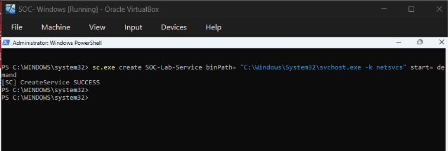
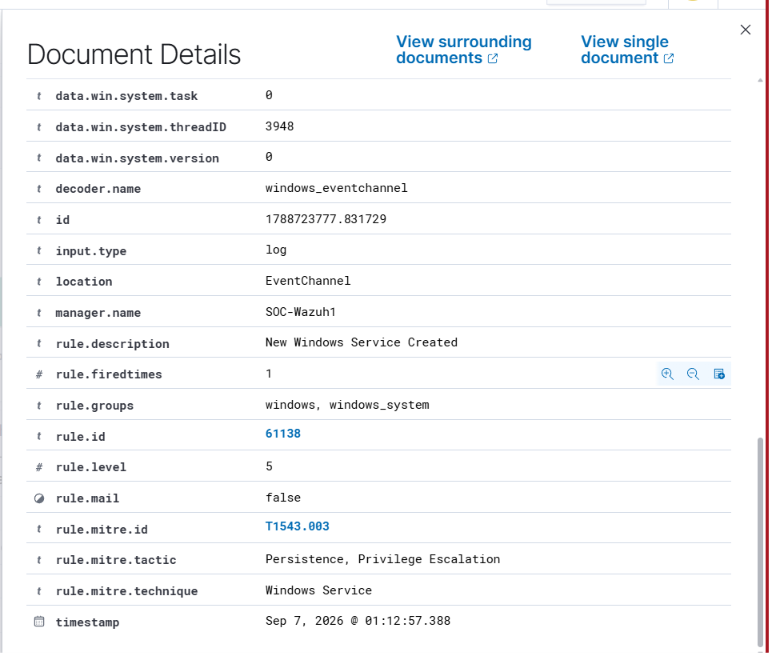
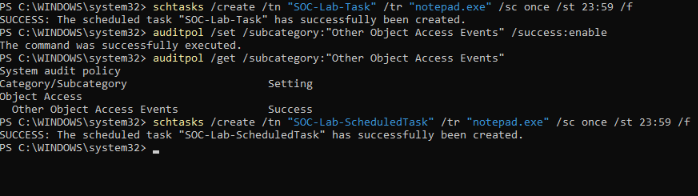
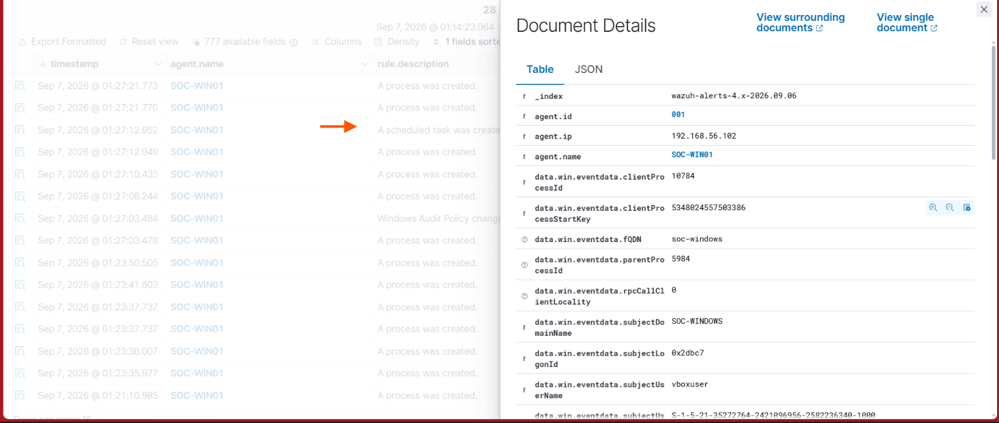

## 05.1 Failed Windows Logon Detection

I generated controlled failed login attempts on the Windows endpoint (SOC-WIN01) using an incorrect password.

Wazuh successfully detected the authentication failures and generated multiple events with the rule:

- Rule: Logon Failure - Unknown user or bad password
- Rule ID: 60122
- Rule Level: 5
- Agent: SOC-WIN01

### Evidence


## 05.2 Successful Windows Logon Detection

A successful interactive logon was observed on the Windows endpoint.

Wazuh recorded the event as:

- Event: Windows Workstation Logon Success
- Rule ID: 60118
- Rule Level: 3
- Agent: SOC-WIN01

A related special privilege assignment event was also observed.

### Evidence


## 05.3 User/Account Creation Detection

A controlled local user account creation activity was performed on the Windows endpoint (SOC-WIN01) using PowerShell.

### Controlled Activity

The following command was executed from an elevated PowerShell session:

```powershell
net user SOC-TestUser "Test@12345" /add
```
The command completed successfully and created the test account.
### Screenshot


### Wazuh Detection

 Wazuh detected the account creation activity on the Windows endpoint.

#### Detection details:

Rule: User account enabled or created
Rule ID: 60109
Rule Level: 8
Agent: SOC-WIN01
Evidence
### Windows Activity
#### Screenshot


### Wazuh Detection
#### Screenshot


### SOC Interpretation

Account creation is a security-relevant event because attackers may create new accounts for persistence or unauthorized access.

## 05.4 PowerShell Process Creation Detection

A controlled PowerShell activity was performed on the Windows endpoint (SOC-WIN01) to generate process creation telemetry and verify its visibility in Wazuh.

### Controlled Activity

PowerShell was used to execute normal system enumeration commands:

```powershell
Get-Process | Select-Object -First 10
Get-Service | Select-Object -First 10
```

Process creation auditing was then enabled:

```powershell
auditpol /set /subcategory:"Process Creation" /success:enable
```

A new process was then created:

```powershell
Start-Process notepad.exe
```

### Windows Evidence

The PowerShell commands and process creation activity were performed directly on the Windows endpoint.


### Wazuh Detection

Wazuh was used to verify the Windows process creation telemetry generated by the endpoint.

The relevant Windows Security event was:

- **Event ID:** 4688
- **Description:** A new process has been created
- **Agent:** SOC-WIN01

### Wazuh Evidence

The Wazuh Events dashboard was checked after the controlled process creation activity.

The Windows Security process creation event was observed in Wazuh, confirming that the endpoint was sending process creation telemetry to the Wazuh manager.


### SOC Interpretation

PowerShell is a legitimate Windows administration tool, but attackers can also abuse it to execute commands and launch processes.

Windows process creation telemetry provides useful visibility into programs executed on an endpoint and can help a SOC analyst investigate suspicious execution activity.

### Detection Workflow

**PowerShell Activity → Process Creation → Windows Security Event 4688 → Wazuh Collection → SOC Investigation**

## 05.5 Windows Service Creation Detection

A controlled Windows service creation activity was performed on the Windows endpoint (SOC-WIN01) to generate service creation telemetry and verify its visibility in Wazuh.

### Controlled Activity

An administrative PowerShell session was used to create a test Windows service:

    sc.exe create SOC-Lab-Service binPath= "C:\Windows\System32\svchost.exe -k netsvcs" start= demand

The command completed successfully with:

    [SC] CreateService SUCCESS

### Evidence

Windows PowerShell Activity



### Wazuh Detection

Wazuh successfully detected the Windows service creation activity.

The event was identified using:

    Rule Description: New Windows Service Created
    Rule ID: 61138
    Rule Level: 5
    Agent: SOC-WIN01
    MITRE Technique: T1543.003
    Technique: Windows Service
    Tactic: Persistence, Privilege Escalation

Wazuh Detection Evidence



### SOC Interpretation

Windows service creation is security-relevant because attackers can abuse services to establish persistence or execute malicious programs.

## 05.6 Scheduled Task Creation Detection

A controlled scheduled task was created on the Windows endpoint (SOC-WIN01) to verify that Wazuh could detect scheduled task creation activity.

### Controlled Activity

A scheduled task was created using the Windows `schtasks` utility.

Command executed:

`schtasks /create /tn "SOC-Lab-ScheduledTask" /tr "notepad.exe" /sc once /st 23:59 /f`

The command successfully created the scheduled task on the Windows endpoint.

### Windows Evidence



### Wazuh Detection

Wazuh successfully detected the scheduled task creation event generated by the Windows endpoint.

The detected event contained:

- **Agent:** SOC-WIN01
- **Rule Description:** A scheduled task was created
- **Rule ID:** 60228
- **Rule Level:** 4
- **MITRE ATT&CK ID:** T1053
- **MITRE Technique:** Scheduled Task/Job
- **MITRE Tactics:** Execution, Persistence, Privilege Escalation

### Wazuh Evidence



### SOC Interpretation

Scheduled tasks are legitimate Windows functionality used for automation, maintenance, and administration. However, attackers can also abuse scheduled tasks to establish persistence or execute programs.

Monitoring scheduled task creation provides useful visibility for a SOC analyst and can help identify potentially suspicious persistence or execution activity.

This controlled lab demonstrated the following detection workflow:

**Scheduled Task Creation → Windows Event → Wazuh Detection → MITRE ATT&CK Mapping → SOC Investigation**
In this controlled lab, a test service was intentionally created to validate that Wazuh could observe and detect the activity.

The detection demonstrates the workflow:

    Windows Service Creation → Windows Event Telemetry → Wazuh Detection → SOC Investigation
