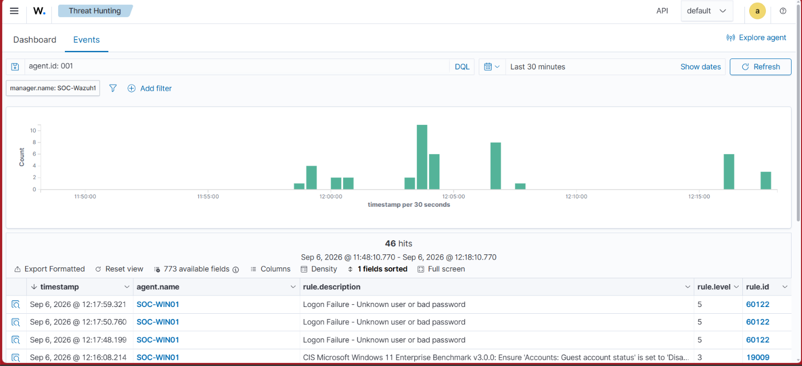
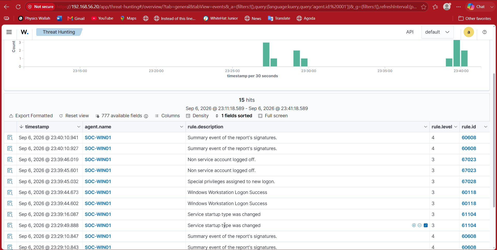
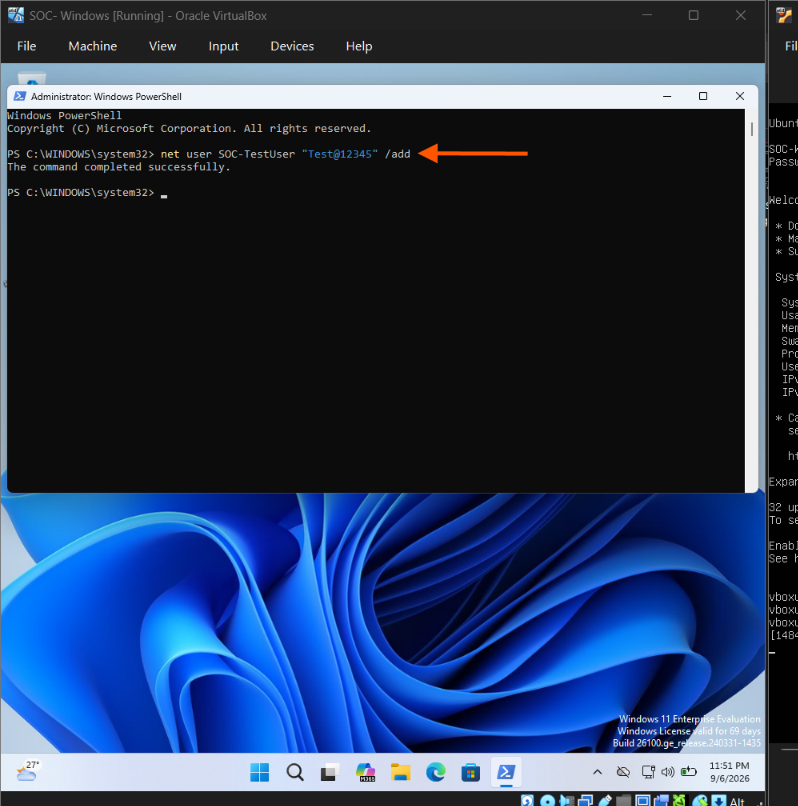
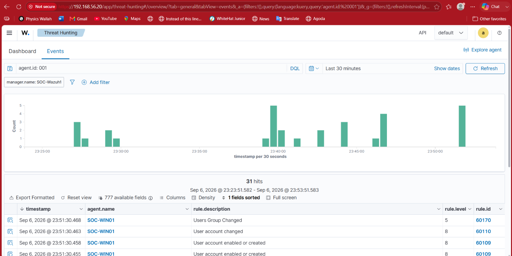

## 05.1 Failed Windows Logon Detection

I generated controlled failed login attempts on the Windows endpoint (SOC-WIN01) using an incorrect password.

Wazuh successfully detected the authentication failures and generated multiple events with the rule:

- Rule: Logon Failure - Unknown user or bad password
- Rule ID: 60122
- Rule Level: 5
- Agent: SOC-WIN01

### Evidence




## 05.2 Successful Windows Logon Detection

A successful interactive logon was observed on the Windows endpoint.

Wazuh recorded the event as:

- Event: Windows Workstation Logon Success
- Rule ID: 60118
- Rule Level: 3
- Agent: SOC-WIN01

A related special privilege assignment event was also observed.

### Evidence




## 05.3 User/Account Creation Detection

A controlled local user account creation activity was performed on the Windows endpoint (SOC-WIN01) using PowerShell.

### Controlled Activity

The following command was executed from an elevated PowerShell session:

```powershell
net user SOC-TestUser "Test@12345" /add
```
The command completed successfully and created the test account.
### Screenshot


### Wazuh Detection

 Wazuh detected the account creation activity on the Windows endpoint.

#### Detection details:

Rule: User account enabled or created
Rule ID: 60109
Rule Level: 8
Agent: SOC-WIN01
Evidence
### Windows Activity
#### Screenshot


### Wazuh Detection
#### Screenshot



### SOC Interpretation

Account creation is a security-relevant event because attackers may create new accounts for persistence or unauthorized access.

In this controlled lab, the account was intentionally created to validate that Wazuh could observe and alert on the activity.

The detection demonstrates the workflow:

User Account Creation → Windows Event → Wazuh Detection → SOC Investigation
