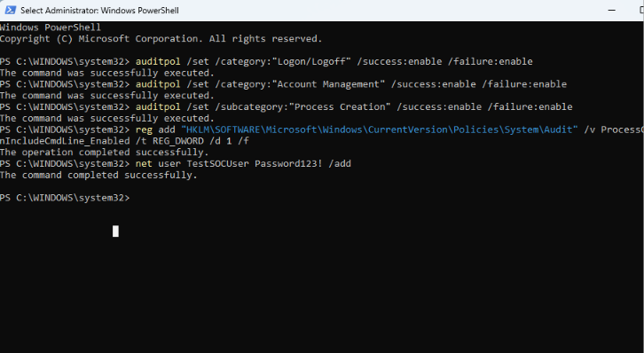
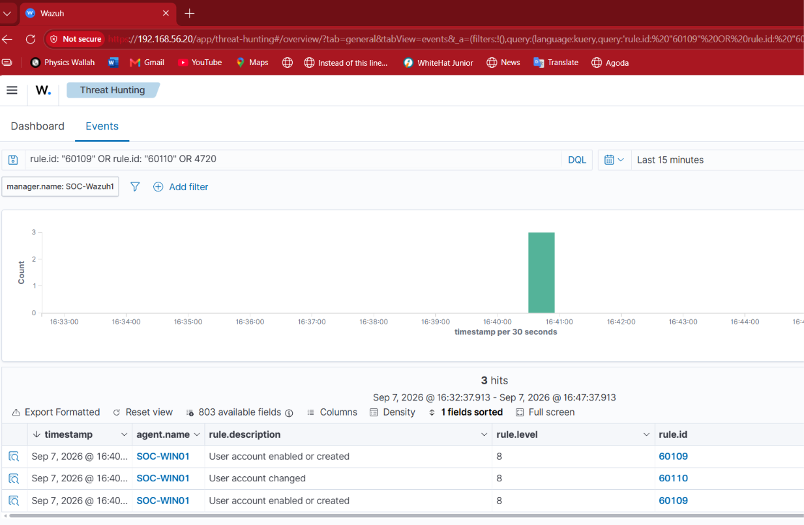
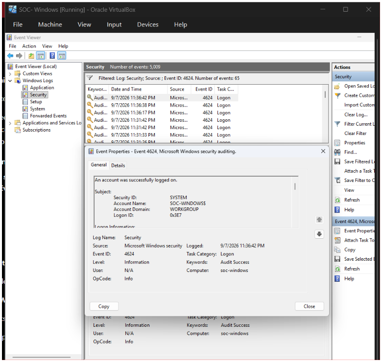
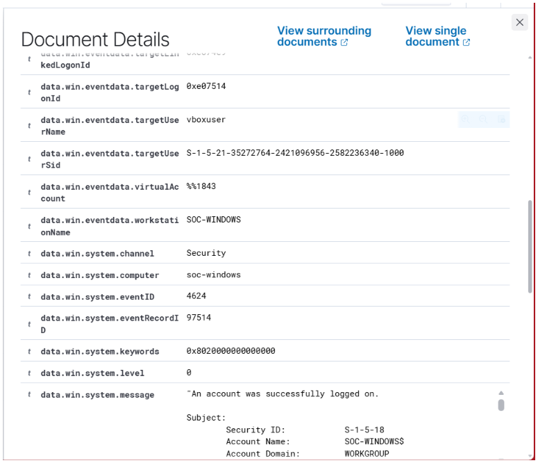
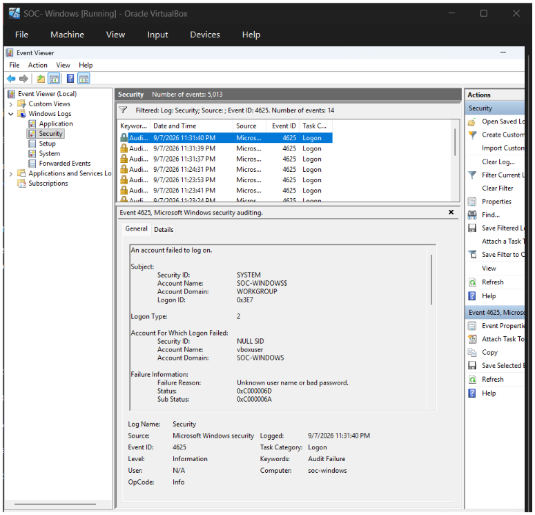
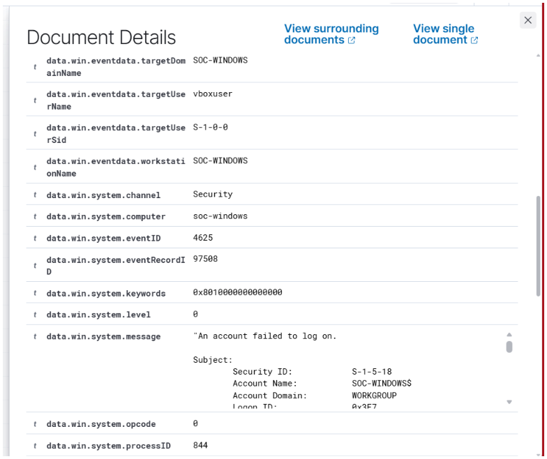

# 06. Windows Security Monitoring

This section focuses on monitoring security-relevant activity on the Windows endpoint using Windows Security logs and Wazuh.

The goal was to understand how Windows records authentication and account-management activity, and how this telemetry can be collected and investigated through Wazuh.

---

## 06.1 Windows Audit Policy Configuration

Windows auditing was configured on the endpoint to generate security telemetry for authentication, account management, and process creation.

The following audit policies were enabled from an elevated PowerShell session:

    auditpol /set /category:"Logon/Logoff" /success:enable /failure:enable

    auditpol /set /category:"Account Management" /success:enable /failure:enable

    auditpol /set /subcategory:"Process Creation" /success:enable

Process creation command-line auditing was also enabled:

    reg add "HKLM\SOFTWARE\Microsoft\Windows\CurrentVersion\Policies\System\Audit" /v ProcessCreationIncludeCmdLine_Enabled /t REG_DWORD /d 1 /f

The Logon audit policy was verified with:

    auditpol /get /subcategory:"Logon"

The result confirmed:

    Logon    Success and Failure

This configuration allows Windows to generate security events that can be collected by the Wazuh agent.

### Evidence

---

## 06.2 Controlled User Account Activity

A controlled local user account creation activity was performed on the Windows endpoint.

The following command was executed from an elevated PowerShell session:

    net user SOC-TestUser "TestUserPassword123!" /add

The command successfully created the test account.

This activity was performed intentionally to generate Windows account-management telemetry and verify that the activity could be detected by Wazuh.

### Windows Activity

---

## 06.3 Wazuh Detection of Account Activity

After the test account was created, the Wazuh Events view was checked for the resulting Windows security events.

Wazuh detected the account activity generated by the endpoint.

The observed detection included:

- Rule Description: User account enabled or created
- Rule ID: 60109
- Rule Level: 8
- Agent: SOC-WIN01

A related account-change event was also observed:

- Rule Description: User account changed
- Rule ID: 60110
- Rule Level: 8
- Agent: SOC-WIN01

### Wazuh Evidence

This confirmed that the account-management activity generated on Windows was successfully collected and processed by Wazuh.

---

## 06.4 Successful Logon Detection

Windows Security Event ID 4624 represents a successful account logon.

A successful logon event was observed on the Windows endpoint through the Security event log.

### Event Details

- Event ID: 4624
- Log: Security
- Source: Microsoft-Windows-Security-Auditing
- Task Category: Logon
- Keywords: Audit Success
- Computer: soc-windows

The event was also visible in Wazuh, confirming that Windows authentication telemetry was being collected by the Wazuh agent.

### Windows Evidence

### Wazuh Evidence

---

## 06.5 Failed Logon Detection

Windows Security Event ID 4625 represents a failed account logon.

Controlled failed authentication attempts were generated by entering an incorrect password for the vboxuser account.

Windows recorded the activity as Event ID 4625.

### Event Details

- Event ID: 4625
- Log: Security
- Source: Microsoft-Windows-Security-Auditing
- Task Category: Logon
- Keywords: Audit Failure
- Account: vboxuser
- Logon Type: 2
- Failure Reason: Unknown user name or bad password

The event was verified locally using PowerShell:

    Get-WinEvent -FilterHashtable @{LogName='Security'; Id=4625} -MaxEvents 5 |
    Select-Object TimeCreated, Id, Message

The command returned multiple Event ID 4625 records.

### Windows Evidence

### Wazuh Evidence

The same authentication failure was observed in Wazuh.

This confirmed the telemetry path:

**Failed Authentication → Windows Security Event 4625 → Wazuh Agent → Wazuh Manager → SOC Investigation**

---

## 06.6 Authentication Event Comparison

The two authentication events provide different security signals.

| Event ID | Meaning | Security Status |
|---|---|---|
| 4624 | Successful logon | Audit Success |
| 4625 | Failed logon | Audit Failure |

A single failed logon does not necessarily indicate malicious activity. Users may enter an incorrect password during normal activity.

However, repeated failed logons can become security-relevant, especially when they occur against the same account, originate from an unusual source, occur at an unusual time, or are followed by a successful authentication.

A SOC analyst should therefore investigate authentication events in context rather than treating every event as malicious.

---

## 06.7 PowerShell Event Verification

Windows Security events were also queried directly from the endpoint using PowerShell.

Failed logons were verified with:

    Get-WinEvent -FilterHashtable @{LogName='Security'; Id=4625} -MaxEvents 5 |
    Select-Object TimeCreated, Id, Message

Successful logons were verified with:

    Get-WinEvent -FilterHashtable @{LogName='Security'; Id=4624} -MaxEvents 5 |
    Select-Object TimeCreated, Id, Message

This provided an additional way to verify the events directly from the Windows Security log.

---

## 06.8 SOC Interpretation

Windows Security logs provide valuable endpoint telemetry for a SOC analyst.

Authentication events can help answer questions such as:

- Which account was involved?
- Was the authentication successful or unsuccessful?
- When did the activity occur?
- What type of logon was requested?
- Were there repeated failed attempts?
- Was a successful login observed after multiple failures?
- Does the activity match expected user behaviour?
- Are there related security events that provide additional context?

Account-management events are also important because unexpected account creation or modification may indicate unauthorized access or persistence activity.

The events must always be analysed in context because legitimate administrative and user activity can generate the same Windows event types.

---

## Detection Workflow

The monitoring workflow demonstrated in this section was:

**Controlled Activity → Windows Security Audit → Windows Security Event → Wazuh Agent → Wazuh Manager → SOC Investigation**

---

## Key Takeaways

This lab demonstrated how Windows Security auditing can provide useful authentication and account-management telemetry for SOC monitoring.

The main authentication events investigated were:

- 4624 — Successful logon
- 4625 — Failed logon

Account-management activity was also generated and detected by Wazuh.

The activity was verified through Windows Security logs, PowerShell, and the Wazuh Events interface.

This exercise provided practical experience with:

- Windows Security Event Logs
- Windows audit policies
- Authentication monitoring
- Account-management monitoring
- Event ID 4624
- Event ID 4625
- Wazuh event collection
- Wazuh rule identification
- Basic SOC event investigation

The next sections of the project will build on this endpoint visibility by monitoring additional types of Windows activity.
