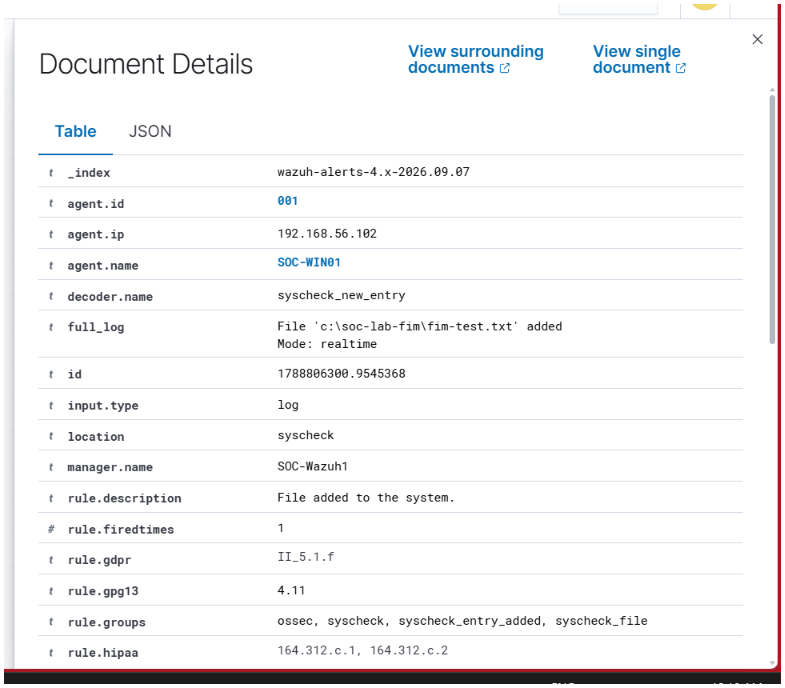
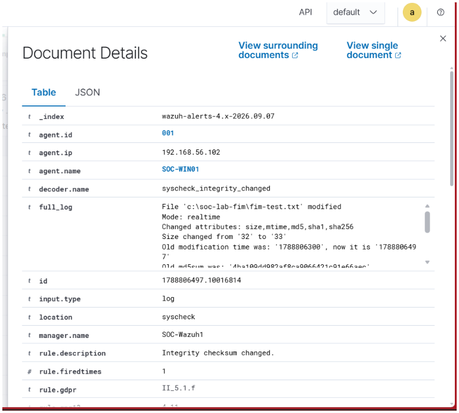
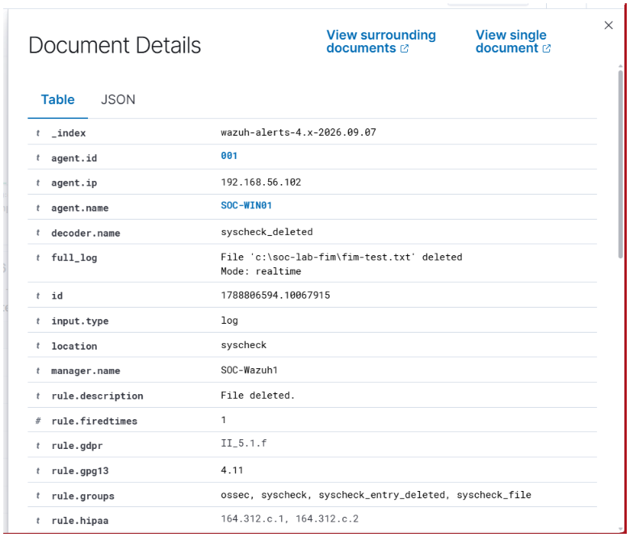
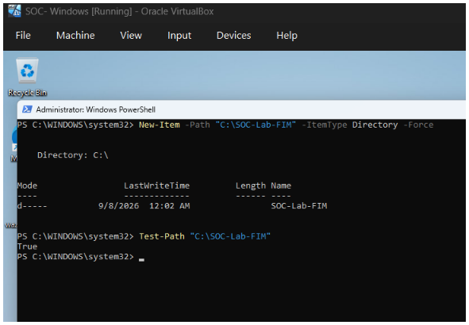
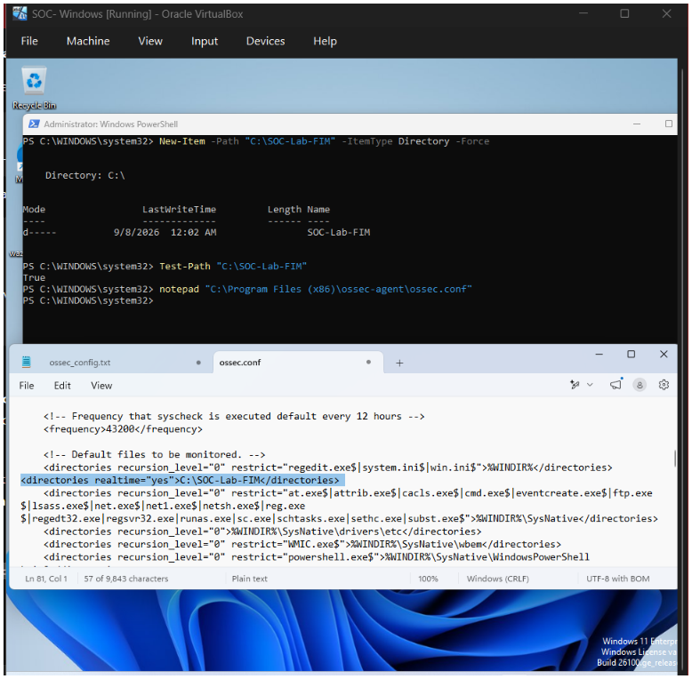

# 07 – File Integrity Monitoring

## Overview

File Integrity Monitoring (FIM) is a security monitoring technique used to detect changes made to files on a system.

In this lab, Wazuh Syscheck was configured to monitor a dedicated Windows test directory in real time. Controlled file activity was then performed on the Windows endpoint to verify that Wazuh could detect file creation, modification, and deletion.

The purpose of this exercise was to understand how a SOC analyst can use FIM alerts to identify unauthorized or suspicious changes to files.

---

## Lab Environment

| Component | Details |
|---|---|
| Endpoint | Windows 11 |
| Hostname | SOC-WIN01 |
| Agent IP | 192.168.56.102 |
| SIEM / Manager | Wazuh |
| Wazuh Manager | SOC-Wazuh1 |
| Monitoring Technology | Wazuh Syscheck |
| Monitoring Mode | Realtime |
| Test Directory | `C:\SOC-Lab-FIM` |
| Test File | `fim-test.txt` |

---

## Objective

The objectives of this practical were:

- Configure Wazuh File Integrity Monitoring.
- Monitor a dedicated Windows test directory.
- Generate controlled file activity.
- Verify that Wazuh detects file creation.
- Verify that Wazuh detects file modification.
- Verify that Wazuh detects file deletion.
- Examine the resulting Wazuh alerts as a SOC analyst.

---

## FIM Configuration

A dedicated directory was created on the Windows endpoint:

`C:\SOC-Lab-FIM`

The Wazuh Syscheck configuration was updated to monitor this directory with realtime monitoring enabled.

The Wazuh agent service was restarted after the configuration change.

The service status was verified to ensure that the Wazuh agent was running correctly.

---

## Controlled Testing

A test file named `fim-test.txt` was created inside the monitored directory.

The following activities were performed:

1. File creation
2. File modification
3. File deletion

Each activity was observed in Wazuh to confirm that the corresponding integrity event was received from the Windows endpoint.

---

## Detection Results

### 1. File Creation

A new file was created:

`C:\SOC-Lab-FIM\fim-test.txt`

Wazuh detected the activity with the Syscheck decoder.

The alert contained:

- Agent: `SOC-WIN01`
- Decoder: `syscheck_new_entry`
- Location: `syscheck`
- Description: `File added to the system`
- Mode: `realtime`

---

### 2. File Modification

The contents of `fim-test.txt` were modified after creation.

Wazuh detected the change and reported an integrity checksum change.

The event contained:

- Agent: `SOC-WIN01`
- Decoder: `syscheck_integrity_changed`
- File: `C:\SOC-Lab-FIM\fim-test.txt`
- Mode: `realtime`
- Description: `Integrity checksum changed`
- Changes to file attributes and hashes

---

### 3. File Deletion

The test file was deleted from the monitored directory.

Wazuh detected the deletion and generated a Syscheck event.

The event contained:

- Agent: `SOC-WIN01`
- Decoder: `syscheck_deleted`
- File: `C:\SOC-Lab-FIM\fim-test.txt`
- Mode: `realtime`
- Description: `File deleted`

---

## Evidence

### FIM Test Directory

The Windows test directory was created and verified before monitoring activity was performed.

### Wazuh FIM Configuration

The Wazuh Syscheck configuration was updated to include the test directory for monitoring.

---

## SOC Analyst Perspective

From a SOC perspective, File Integrity Monitoring can help identify unexpected changes to important files and directories.

A file change by itself does not necessarily indicate malicious activity. An analyst should investigate the context of the change, including:

- Which file was changed?
- Which system was affected?
- When did the change occur?
- Was the change expected?
- What process or user may have caused the change?
- Were other suspicious events observed around the same time?

FIM alerts can therefore provide useful evidence during security investigations and incident response.

---

## Key Takeaways

- FIM monitors files and directories for changes.
- Wazuh Syscheck can detect file creation, modification, and deletion.
- Realtime monitoring allows changes to be detected shortly after they occur.
- Hash and file attribute changes can provide useful integrity evidence.
- FIM alerts should be investigated in context rather than treated as automatically malicious.
- File integrity monitoring is an important capability for endpoint security monitoring in a SOC environment.

---

## Evidence Summary

| Activity | Wazuh Detection | Evidence |
|---|---|---|
| Directory setup | Test directory created | `01-fim-directory-created.png` |
| Configuration | Syscheck FIM configuration | `02-fim-configuration.png` |
| File creation | `syscheck_new_entry` | `03-fim-file-created-wazuh.png` |
| File modification | `syscheck_integrity_changed` | `04-fim-file-modified-wazuh.png` |
| File deletion | `syscheck_deleted` | `05-fim-file-deleted-wazuh.png` |

---

## Conclusion

This practical demonstrated a complete File Integrity Monitoring workflow using Wazuh and a Windows endpoint.

A controlled file was created, modified, and deleted inside a monitored directory, and Wazuh successfully generated corresponding integrity events for each activity.

This provides practical experience with endpoint integrity monitoring and demonstrates how FIM data can be used as part of SOC detection and investigation workflows.
