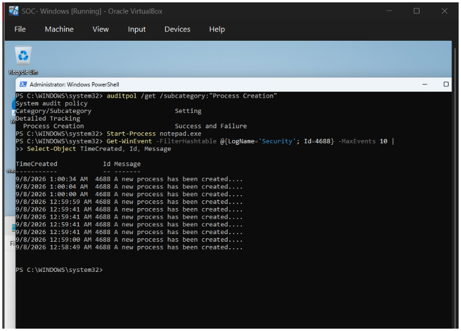
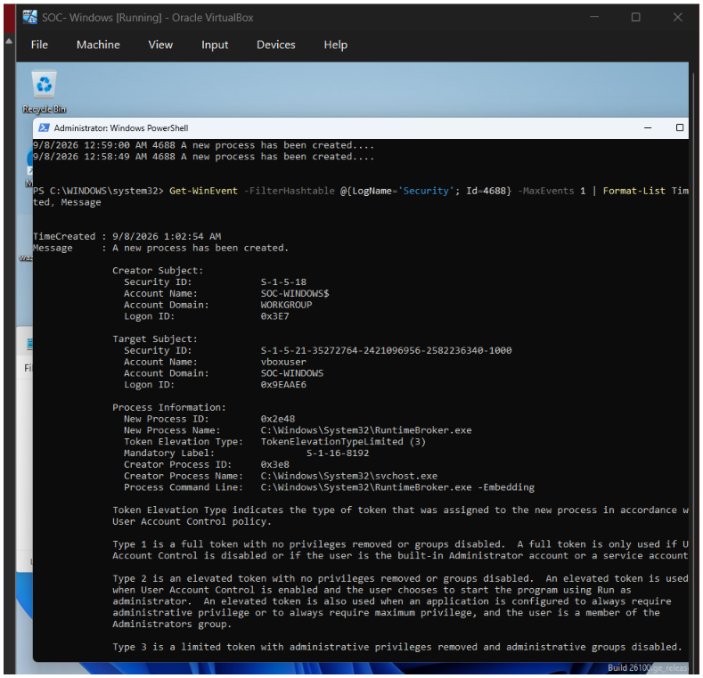
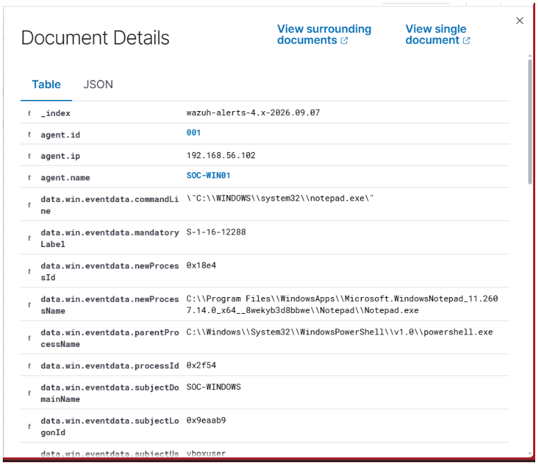
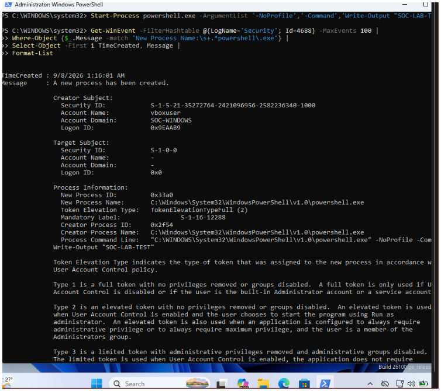
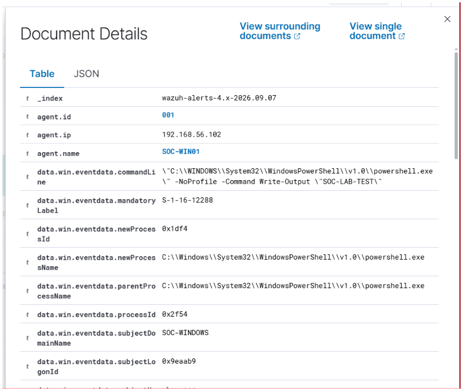
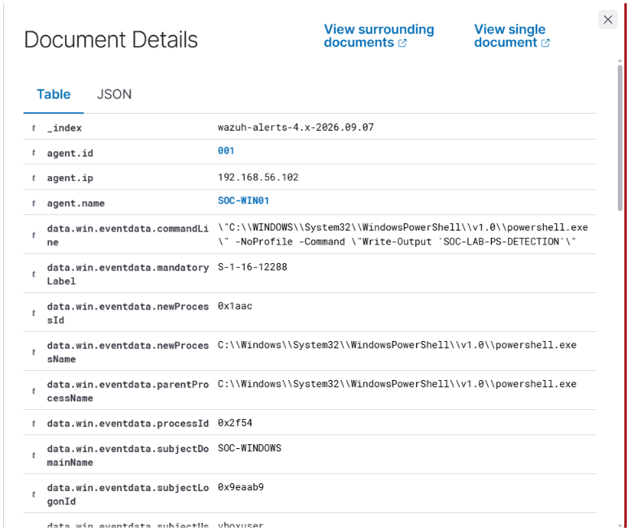
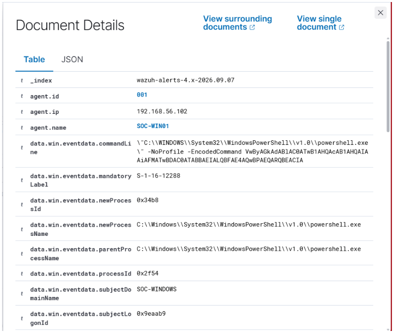
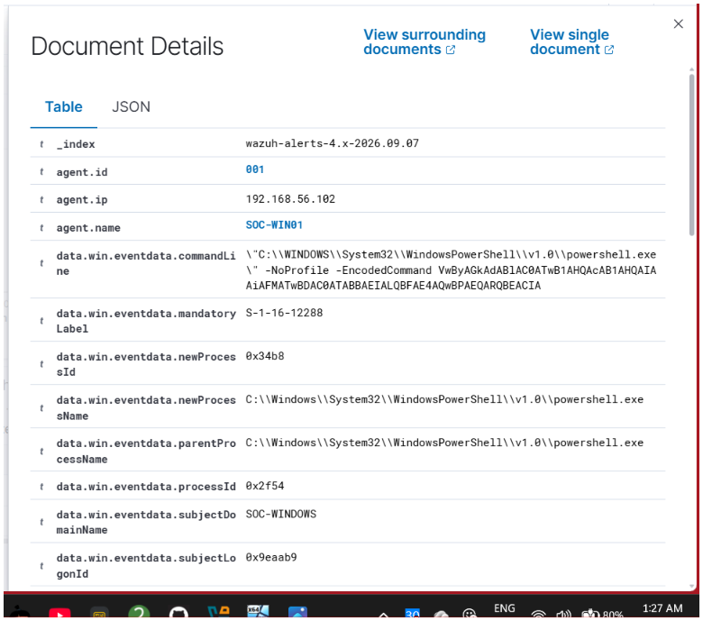
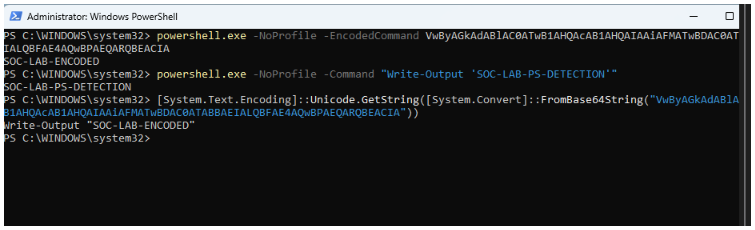
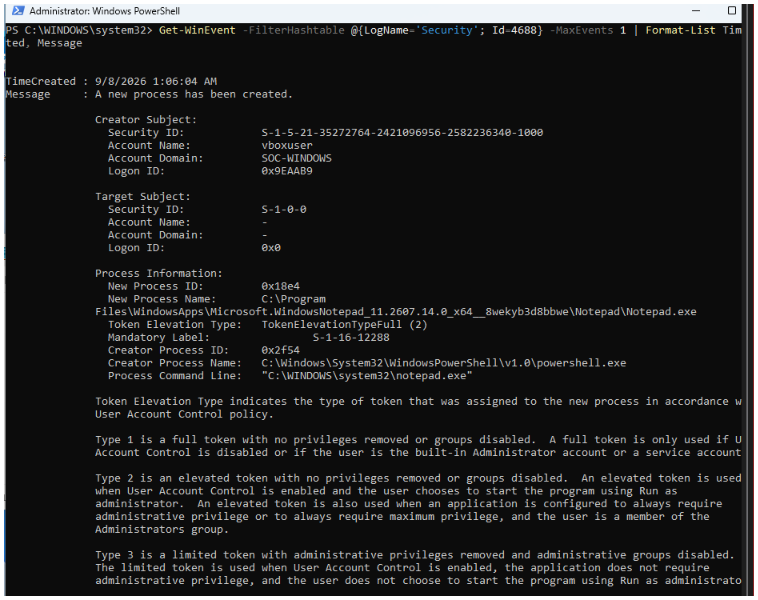

# 08 — Process Creation & PowerShell Detection

## Overview

In this lab, I configured Windows Security auditing and Wazuh to monitor **Process Creation (Event ID 4688)** and investigate PowerShell activity.

The objective was to understand how a SOC analyst can detect:

- New process creation
- PowerShell process execution
- Parent/child process relationships
- PowerShell command-line activity
- Encoded PowerShell commands
- Wazuh detection of PowerShell execution
- Investigation of Windows Event ID 4688

---

## Lab Environment

| Component | Details |
|---|---|
| Endpoint | Windows 11 SOC-WIN01 |
| Wazuh Agent | Agent ID `001` |
| Endpoint IP | `192.168.56.102` |
| Event Log | Windows Security |
| Event ID | `4688` |
| Activity | Process Creation |
| SIEM | Wazuh |
| Detection Source | Windows Security Event Logs |

---

## 1. Enable Process Creation Auditing

I first verified that Windows auditing for **Process Creation** was enabled.

Command used:

    auditpol /get /subcategory:"Process Creation"

The result showed:

- Detailed Tracking
- Process Creation
- Success and Failure

This confirms that Windows is configured to generate process creation events.

---

## 2. Generate a Process Creation Event

I launched Notepad to generate a Windows Security **Event ID 4688**.

Command used:

    Start-Process notepad.exe

Windows generated a new process creation event.

---

## 3. Investigate Event ID 4688

I queried the Windows Security log for Event ID `4688`.

Command used:

    Get-WinEvent -FilterHashtable @{LogName='Security'; Id=4688} -MaxEvents 10 |
    Select-Object -First 10 TimeCreated, Id, Message

The output showed multiple process creation events.

---

## 4. Investigate Process Command-Line Details

I investigated the detailed Event ID 4688 information.

Important fields included:

- New Process ID
- New Process Name
- Creator Process ID
- Creator Process Name
- Process Command Line
- Token Elevation Type

---

## 5. Verify Process Creation in Wazuh

The Windows process creation event was also received by Wazuh.

This demonstrates the flow:

    Windows Endpoint
        ↓
    Windows Security Event 4688
        ↓
    Wazuh Agent
        ↓
    Wazuh Manager
        ↓
    Wazuh Event / Alert

---

## 6. Inspect PowerShell Command-Line Activity

The Wazuh event contained PowerShell command-line information.

This is important because simply seeing `powershell.exe` does not tell the SOC analyst what PowerShell actually executed.

---

## 7. Generate Encoded PowerShell Activity

I then tested an encoded PowerShell command.

Encoded PowerShell is important from a defensive perspective because encoding can make the original command less immediately readable during investigation.

---

## 8. Investigate Encoded PowerShell Detection

Wazuh captured the encoded PowerShell process creation event.

The event contained the PowerShell command line and process information that can be used by a SOC analyst for investigation.

---

## 9. Decode the PowerShell Command

The encoded PowerShell command was decoded to identify the original command.

The decoded command was:

    Write-Output "SOC-LAB-ENCODED"

This demonstrates the investigation process:

    Encoded PowerShell
        ↓
    Extract encoded data
        ↓
    Decode
        ↓
    Read original command
        ↓
    Determine actual behavior

---

## 10. PowerShell Detection with Command-Line Details

I also tested a normal PowerShell command:

    powershell.exe -NoProfile -Command "Write-Output 'SOC-LAB-PS-DETECTION'"

The resulting Event ID `4688` contained the PowerShell command line.

This demonstrates how process creation monitoring can provide visibility into PowerShell execution.

---

# Investigation Flow

The complete investigation flow was:

    Windows Endpoint
          ↓
    Process Created
          ↓
    Windows Security Event ID 4688
          ↓
    Wazuh Agent
          ↓
    Wazuh Manager
          ↓
    Wazuh Alert / Event
          ↓
    SOC Analyst Investigation
          ↓
    Inspect Process Name
          ↓
    Inspect Parent Process
          ↓
    Inspect Command Line
          ↓
    Identify PowerShell Activity
          ↓
    Decode Encoded Command
          ↓
    Determine Actual Behavior

---

# Key SOC Concepts Learned

## Event ID 4688 — Process Creation

Windows Security Event ID `4688` records the creation of a new process.

A SOC analyst can use it to investigate:

- What process was created?
- Which user created it?
- What was the parent process?
- What command line was used?
- Was PowerShell involved?
- Was the command encoded?

---

## Parent and Child Processes

Process creation events provide information about relationships between processes.

For example:

    powershell.exe
          ↓
      child process

The **Creator Process Name** and **Creator Process ID** help establish this relationship.

---

## Command-Line Investigation

The process name alone is not always enough.

For example:

    powershell.exe

does not tell the analyst what PowerShell executed.

The command line provides additional context.

Example:

    powershell.exe -NoProfile -Command "Write-Output 'SOC-LAB-PS-DETECTION'"

---

## Encoded PowerShell

PowerShell supports encoded commands.

From a SOC perspective, encoded PowerShell should be investigated because encoding can make the original command less immediately readable.

The investigation process is:

    Encoded PowerShell
          ↓
    Extract encoded data
          ↓
    Decode
          ↓
    Read original command
          ↓
    Determine whether behavior is suspicious

Encoding by itself does not automatically mean that the activity is malicious. The decoded command and surrounding context must be investigated.

---

# Important Takeaways

- Windows can generate process creation telemetry through Event ID `4688`.
- Wazuh can collect and expose this telemetry for investigation.
- Process creation events contain valuable information about processes and their parent processes.
- PowerShell command-line visibility is useful during SOC investigations.
- Encoded PowerShell deserves investigation because the original command may not be immediately readable.
- Decoding the command helps the analyst understand the actual activity.
- Event ID `4688` can be an important source of endpoint detection and investigation data.

---

# Skills Practiced

- Windows Security Event Logs
- Event ID 4688
- Process Creation Auditing
- PowerShell Monitoring
- PowerShell Command-Line Analysis
- Parent/Child Process Investigation
- Wazuh Alert Investigation
- Encoded PowerShell Analysis
- Basic SOC Detection & Investigation

---

# Screenshots

All screenshots collected during this lab are stored in the `screenshots/` directory.

## Process Creation

## PowerShell Detection

---

# Conclusion

This lab demonstrated how a SOC analyst can use Windows process creation telemetry and Wazuh to investigate PowerShell activity.

The main investigation chain was:

    Process Creation
          ↓
    Event ID 4688
          ↓
    Wazuh
          ↓
    PowerShell Command Line
          ↓
    Encoded PowerShell
          ↓
    Decode
          ↓
    Understand the Actual Command

This lab provided practical experience with endpoint telemetry, SIEM investigation, process analysis, PowerShell detection, and basic command-line investigation.
