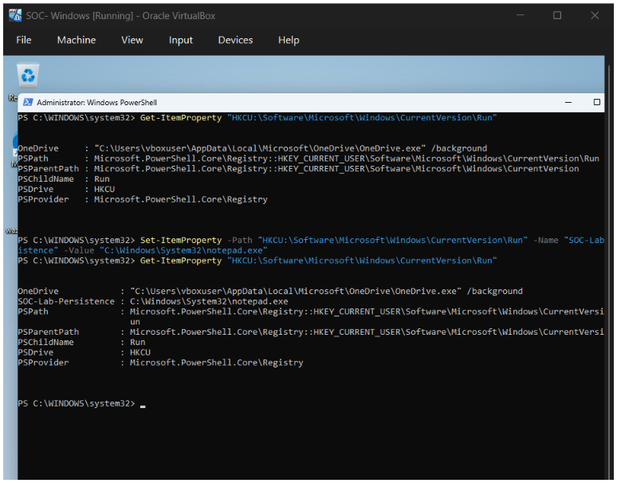
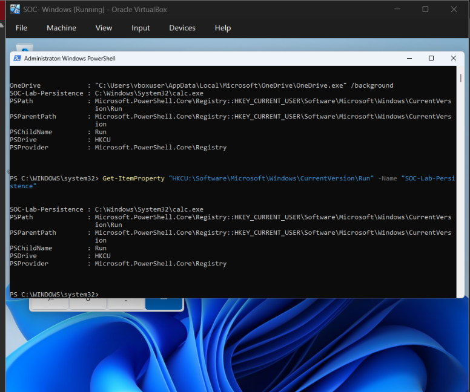
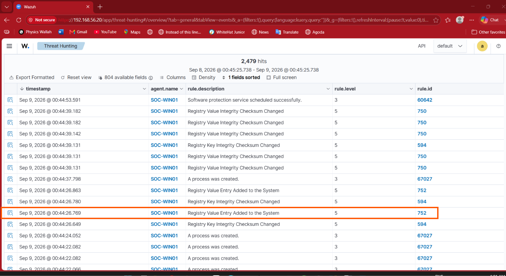
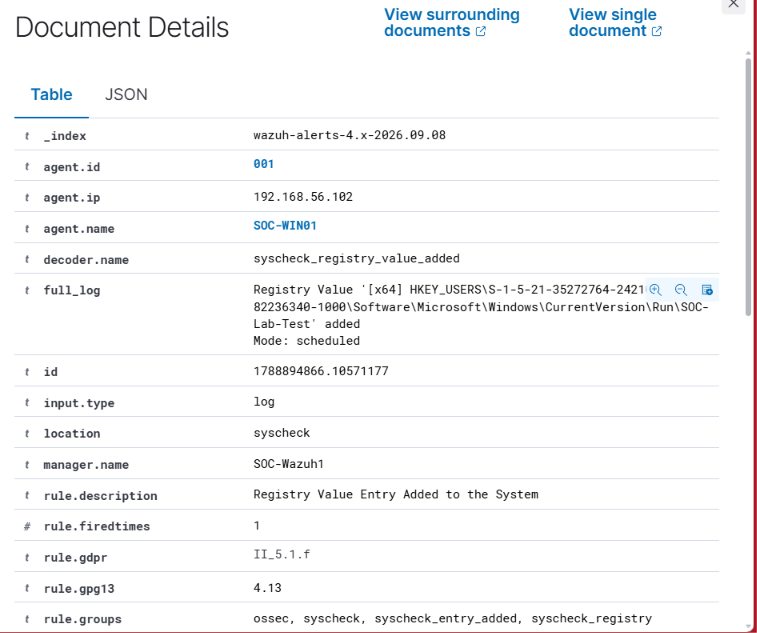
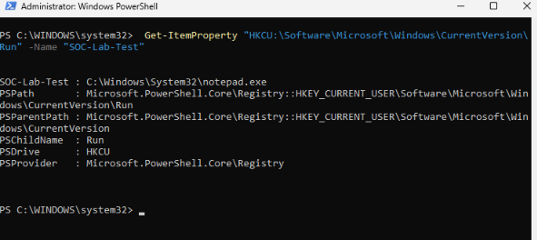
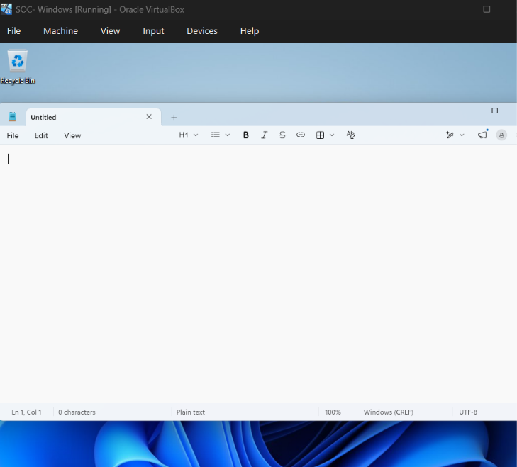

# 09 — Persistence Detection

## Objective

The objective of this lab was to simulate a Windows persistence mechanism using a Registry Run Key, detect the registry modification using Wazuh, investigate the generated alert, and verify that the persistence mechanism executed after user logon.

---

## Lab Environment

| Component | Details |
|---|---|
| SOC Server | Ubuntu + Wazuh |
| Windows Endpoint | SOC-WIN01 |
| Windows IP | 192.168.56.102 |
| Attacker/Test Machine | Kali Linux |
| Persistence Technique | Windows Registry Run Key |
| Detection | Wazuh Syscheck / FIM |

---

## 1. Persistence Detection Overview

Windows Registry Run Keys can be abused to achieve persistence by configuring an application to execute automatically when a user logs into Windows.

For this controlled SOC lab, `notepad.exe` was used as a harmless test executable to simulate persistence.

The workflow was:

    Create Registry Run Key
            ↓
    Configure notepad.exe
            ↓
    Wazuh monitors Registry
            ↓
    Wazuh generates detection
            ↓
    Investigate alert
            ↓
    Log out / Log in
            ↓
    Notepad launches automatically
            ↓
    Persistence confirmed

---

## 2. Create Registry Persistence

A controlled Registry Run Key was created using PowerShell:

    Set-ItemProperty -Path "HKCU:\Software\Microsoft\Windows\CurrentVersion\Run" -Name "SOC-Lab-Test" -Value "C:\Windows\System32\notepad.exe"

The persistence entry was created under:

    HKEY_CURRENT_USER\Software\Microsoft\Windows\CurrentVersion\Run

The configured value was:

    SOC-Lab-Test → C:\Windows\System32\notepad.exe

### Evidence

This screenshot shows the controlled Registry Run Key persistence entry.

---

## 3. Verify Registry Persistence

The persistence entry was verified using PowerShell:

    Get-ItemProperty "HKCU:\Software\Microsoft\Windows\CurrentVersion\Run" -Name "SOC-Lab-Test"

The output confirmed:

    SOC-Lab-Test : C:\Windows\System32\notepad.exe

### Evidence

This confirms that the `SOC-Lab-Test` value exists and is configured to launch `notepad.exe`.

---

## 4. Configure Wazuh Registry Monitoring

Wazuh Syscheck/FIM was configured to monitor the user's Registry Run Key through the corresponding Windows user SID:

    HKEY_USERS\S-1-5-21-35272764-2421096956-2582236340-1000\Software\Microsoft\Windows\CurrentVersion\Run

This allowed Wazuh to monitor changes to the user's Run registry location.

---

## 5. Wazuh Persistence Detection

After the Registry Run Key value was added, Wazuh generated the following detection:

| Field | Value |
|---|---|
| Rule ID | 752 |
| Rule Description | Registry Value Entry Added to the System |
| Rule Level | 5 |
| Decoder | syscheck_registry_value_added |

The alert identified the affected Registry Run Key:

    ...\Software\Microsoft\Windows\CurrentVersion\Run\SOC-Lab-Test

### Evidence

This demonstrates that Wazuh detected the creation of the Registry Run Key value.

---

## 6. Investigate the Wazuh Alert

The Rule 752 alert was investigated through:

    Wazuh
    → Threat Hunting
    → Events
    → Rule 752
    → Document Details

The investigation identified:

| Field | Result |
|---|---|
| Agent | SOC-WIN01 |
| Decoder | syscheck_registry_value_added |
| Rule ID | 752 |
| Description | Registry Value Entry Added to the System |
| Registry Location | HKEY_USERS\<User-SID>\Software\Microsoft\Windows\CurrentVersion\Run\SOC-Lab-Test |

### Evidence

The Document Details view provides detailed endpoint telemetry for the registry persistence event.

---

## 7. Verify the Persistence Configuration

The Registry Run Key was verified again from PowerShell:

    Get-ItemProperty "HKCU:\Software\Microsoft\Windows\CurrentVersion\Run" -Name "SOC-Lab-Test"

The value confirmed:

    SOC-Lab-Test : C:\Windows\System32\notepad.exe

### Evidence

This confirms the relationship between the Registry Run Key and the configured executable.

---

## 8. Validate Persistence Execution

To validate that the persistence mechanism actually executed, the Windows user session was logged out and the `vboxuser` account was logged back in.

After logging back in, `notepad.exe` automatically launched.

This confirmed that the Registry Run Key was functioning as a startup persistence mechanism.

### Evidence

This provides execution-level proof that the configured persistence mechanism worked after user logon.

---

## 9. SOC Analyst Investigation

From a SOC analyst perspective, an unexpected Registry Run Key modification should be investigated because attackers can abuse startup locations to maintain execution across user logons.

Important investigation questions include:

- Which user created the registry entry?
- Which process performed the modification?
- What executable is configured?
- Is the executable legitimate?
- Was the change authorized?
- Does the executable have a suspicious hash or reputation?
- Are there related PowerShell or process creation events?
- Are additional persistence mechanisms present?

In this lab, the activity was intentionally generated and therefore represents authorized laboratory activity.

---

## 10. Detection Timeline

    Registry Run Key Created
            ↓
    SOC-Lab-Test Configured
            ↓
    notepad.exe Configured
            ↓
    Wazuh Syscheck Monitoring
            ↓
    Rule 752 Generated
            ↓
    Alert Investigated
            ↓
    Windows User Logged Out
            ↓
    Windows User Logged In
            ↓
    Notepad Automatically Started
            ↓
    Persistence Confirmed

---

## 11. MITRE ATT&CK Mapping

**Technique:** T1547.001 — Registry Run Keys / Startup Folder

This lab specifically demonstrated the Registry Run Keys portion of the technique.

---

## 12. Detection Summary

| Activity | Result |
|---|---|
| Registry Run Key created | ✅ |
| Persistence value configured | ✅ |
| Wazuh Registry monitoring | ✅ |
| Wazuh Rule 752 triggered | ✅ |
| Alert investigated | ✅ |
| Exact Registry path identified | ✅ |
| Persistence executed after login | ✅ |
| Detection workflow completed | ✅ |

---

## 13. Evidence Screenshots

### Screenshot 01 — Registry Persistence Created

`01-persistence-created.png`

Shows the creation of the controlled `SOC-Lab-Test` Registry Run Key.

### Screenshot 02 — Registry Value Verification

`02-registry-value-verification.png`

Shows the `SOC-Lab-Test` value configured to launch `notepad.exe`.

### Screenshot 03 — Wazuh Alert Document Details

`03-wazuh-alert-document-details.png`

Shows the detailed Wazuh Rule 752 event and the affected Registry Run Key.

### Screenshot 04 — Persistence Value Verification

`04-soc-lab-test-registry-value.png`

Shows PowerShell verification of the persistence value and configured executable.

### Screenshot 05 — Persistence Execution

`05-persistence-execution-after-login.png`

Shows Notepad automatically launching after logging back into Windows, confirming successful persistence.

### Screenshot 06 — Wazuh Registry Detection Overview

`06-wazuh-registry-detection-overview.png`

Shows the Wazuh Threat Hunting results containing the Registry Value Entry Added detection.

---

## Conclusion

This exercise demonstrated a complete Windows persistence detection workflow using Wazuh.

A controlled Registry Run Key was created on the Windows endpoint and configured to launch `notepad.exe`. Wazuh Syscheck detected the registry value addition using Rule 752, allowing the event to be investigated through the Wazuh Threat Hunting interface.

The persistence mechanism was then validated by logging out and logging back into Windows, after which Notepad automatically launched.

The complete SOC workflow was:

    Persistence
        ↓
    Endpoint Registry Modification
        ↓
    Wazuh Telemetry
        ↓
    Alert Generation
        ↓
    Alert Investigation
        ↓
    Execution Validation
        ↓
    SOC Assessment

This practical demonstrates how endpoint telemetry and Wazuh can be used to identify and investigate Windows Registry-based persistence.
