# 10 — Authentication Monitoring

# Practical - 1 Windows Authentication Event Investigation

## Objective

The objective of this lab was to monitor Windows authentication activity using Wazuh and investigate authentication context beyond simply identifying a successful logon.

The investigation focused on:

- Identifying the authenticated user
- Identifying the logon type
- Identifying the authentication package
- Identifying the source address
- Identifying the logon session
- Identifying the workstation involved
- Understanding how authentication telemetry can support SOC investigations

---

## Lab Environment

| Component | Details |
|---|---|
| SOC Server | Ubuntu + Wazuh |
| Windows Endpoint | SOC-WIN01 |
| Windows IP | 192.168.56.102 |
| User | vboxuser |
| Log Source | Windows Security Event Log |
| Windows Event | 4624 |
| Wazuh Rule | 60118 |
| Detection | Windows Workstation Logon Success |

---

## 1. Authentication Monitoring Overview

Authentication monitoring provides visibility into user access to Windows endpoints.

From a SOC perspective, an authentication event should not be treated only as "login successful" or "login failed". The analyst should examine the surrounding authentication context.

The investigation workflow was:

    Authentication Event
            ↓
    Identify User
            ↓
    Identify Logon Type
            ↓
    Identify Source
            ↓
    Identify Session
            ↓
    Identify Authentication Package
            ↓
    Investigate Authentication Context

---

## 2. Detect Windows Authentication with Wazuh

Wazuh was used to collect Windows Security authentication telemetry from `SOC-WIN01`.

The investigated detection was:

| Field | Value |
|---|---|
| Windows Event ID | 4624 |
| Wazuh Rule ID | 60118 |
| Rule Description | Windows Workstation Logon Success |
| Rule Level | 3 |
| Agent | SOC-WIN01 |

The event was investigated through:

    Wazuh
    → Threat Hunting
    → Events
    → Windows Workstation Logon Success
    → Document Details

### Evidence

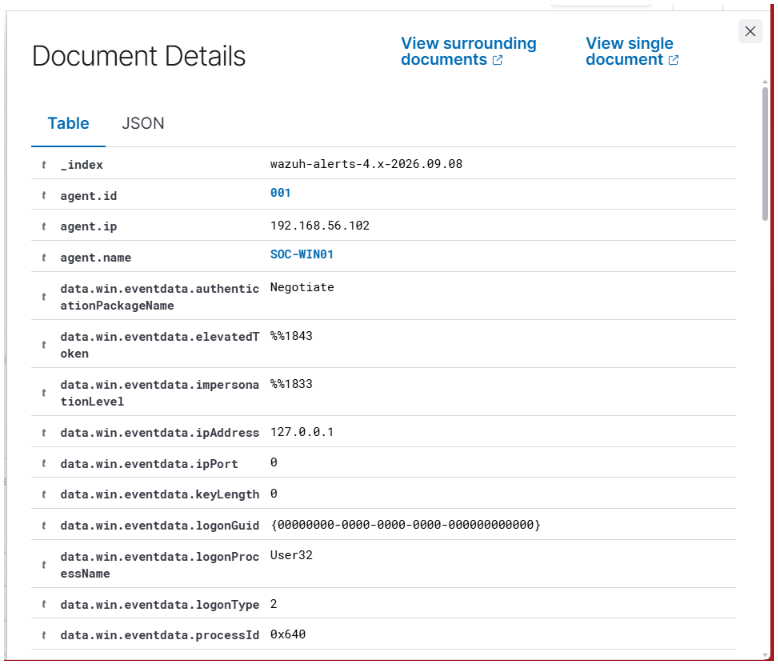

This screenshot shows the authentication event and the important authentication fields collected by Wazuh.

---

## 3. Authentication Context Investigation

The Wazuh event was examined to identify the authentication context.

Important fields included:

| Field | Observed Value |
|---|---|
| Agent Name | SOC-WIN01 |
| Agent IP | 192.168.56.102 |
| Authentication Package | Negotiate |
| Source IP | 127.0.0.1 |
| Source Port | 0 |
| Logon Process | User32 |
| Logon Type | 2 |
| Target Domain | SOC-WINDOWS |
| Target User | vboxuser |
| Target User SID | S-1-5-21-35272764-2421096956-2582236340-1000 |
| Target Logon ID | 0x44da78 |
| Workstation | SOC-WINDOWS |
| Windows Event ID | 4624 |

### Evidence

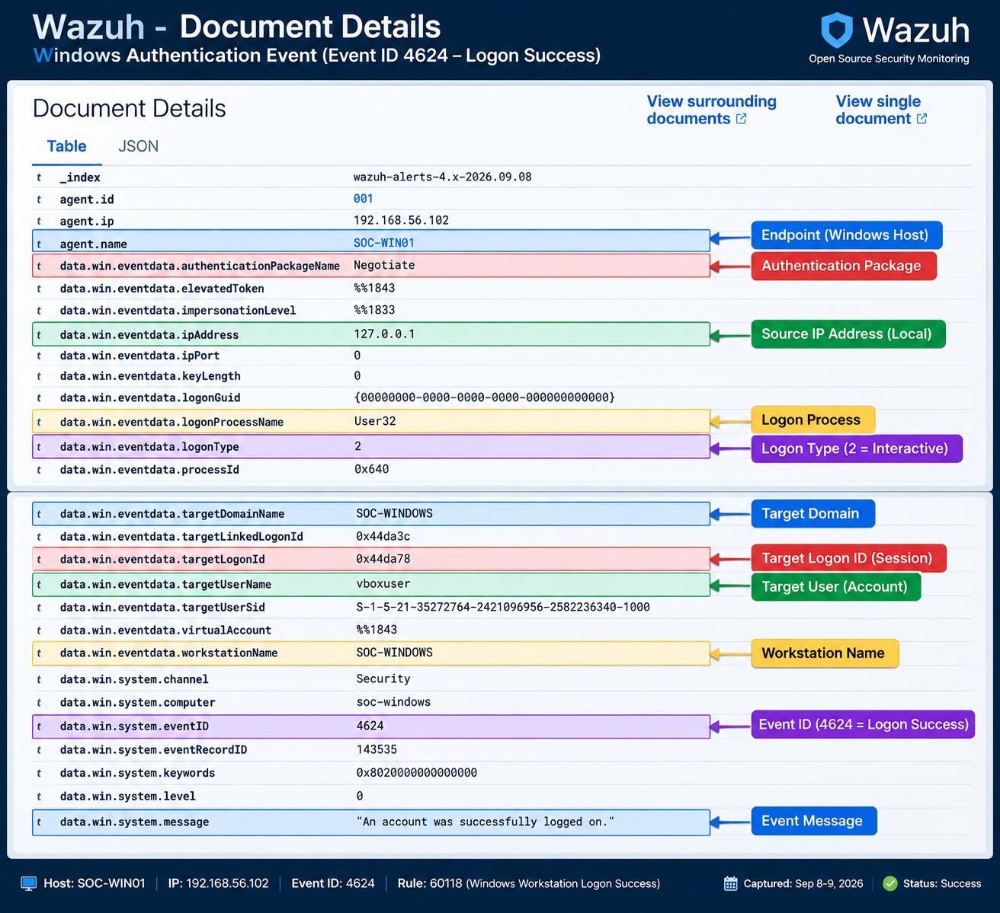

This screenshot shows the user, session, workstation and authentication context identified during the investigation.

---

## 4. Authentication Monitoring Pattern

The Wazuh Threat Hunting view showed multiple `Windows Workstation Logon Success` events for `SOC-WIN01`.

The events were reviewed to understand authentication activity over time rather than examining a single login in isolation.

The investigation considered:

- Number of successful authentication events
- Timestamp of authentication activity
- Endpoint involved
- Authentication rule
- Repeated authentication patterns

### Evidence

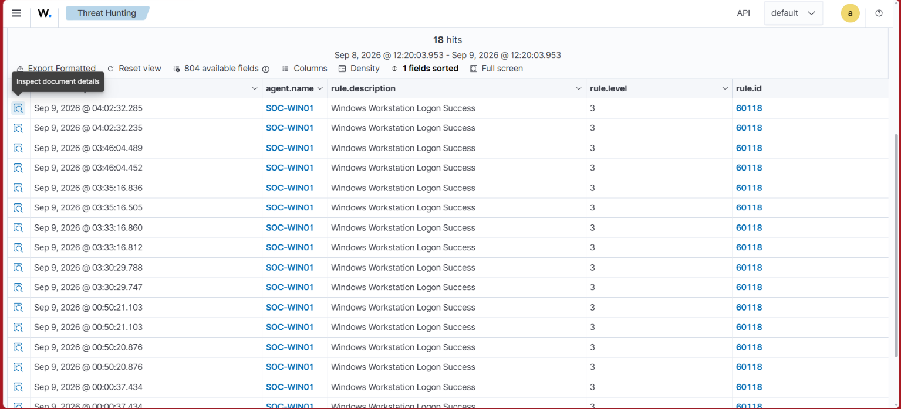

This screenshot shows the repeated Windows Workstation Logon Success events observed by Wazuh.

---

## 5. Logon Type Analysis

The investigated authentication event contained:

    Logon Type: 2

Logon Type 2 represents an interactive logon.

This is consistent with a local interactive user session.

The logon type is an important investigation field because it helps an analyst understand the context of the authentication event.

Examples of different logon contexts include:

    Logon Type 2
    → Interactive

    Logon Type 3
    → Network

    Logon Type 10
    → Remote Interactive / RDP

The analyst should therefore examine the logon type together with the account, source address, workstation and surrounding activity.

### Evidence

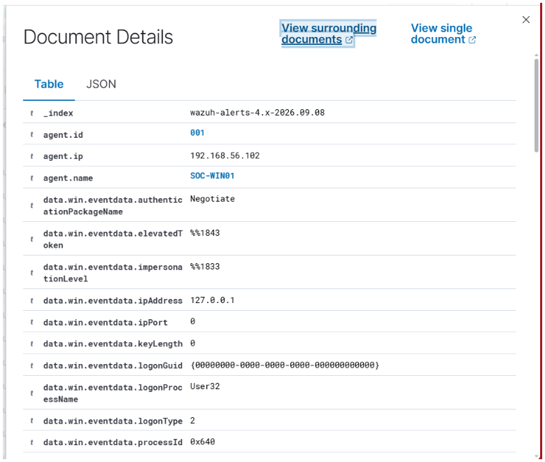

This evidence highlights the most important authentication fields from the investigated Event ID 4624.

---

## 6. User and Session Identification

The authentication event identified:

    Target User:
    vboxuser

The corresponding user SID was:

    S-1-5-21-35272764-2421096956-2582236340-1000

The authentication session was identified using:

    Target Logon ID:
    0x44da78

The Logon ID can provide useful session context when correlating related Windows security events.

---

## 7. Source Analysis

The investigated event reported:

    Source IP:
    127.0.0.1

    Source Port:
    0

`127.0.0.1` is the local loopback address.

Therefore, this particular event does not provide evidence of a remote source IP.

A SOC analyst should avoid interpreting this event as a remote authentication attempt without supporting telemetry.

---

## 8. Authentication Package and Logon Process

The event reported:

    Authentication Package:
    Negotiate

    Logon Process:
    User32

These fields provide additional context about how Windows processed the authentication event.

Together with the user, logon type, source address and session ID, they provide a more complete authentication profile.

---

## 9. SOC Investigation

A SOC analyst should not stop at:

    Event ID 4624 = successful login

Instead, the analyst should establish the authentication context:

    Who authenticated?
            ↓
    What type of logon occurred?
            ↓
    Was the source local or remote?
            ↓
    Which session was created?
            ↓
    Which authentication package was used?
            ↓
    What additional activity occurred around the event?

For this investigation, the observed context was:

    User:
    vboxuser

    Logon Type:
    2 — Interactive

    Source:
    127.0.0.1

    Logon ID:
    0x44da78

    Authentication Package:
    Negotiate

    Logon Process:
    User32

This represents a locally observed interactive authentication session on `SOC-WIN01`.

---

## 10. Investigation Findings

| Investigation Item | Finding |
|---|---|
| Endpoint | SOC-WIN01 |
| User | vboxuser |
| Authentication Result | Successful |
| Windows Event | 4624 |
| Wazuh Rule | 60118 |
| Logon Type | 2 — Interactive |
| Source Address | 127.0.0.1 |
| Authentication Package | Negotiate |
| Logon Process | User32 |
| Session ID | 0x44da78 |
| Workstation | SOC-WINDOWS |

No remote authentication source was established from this particular event.

The activity was generated within the controlled home lab environment.

---

## 11. MITRE ATT&CK Context

The investigated Wazuh rule included:

    T1078 — Valid Accounts

Authentication telemetry can be useful when investigating potential use of legitimate accounts for unauthorized access.

In this controlled home lab, the authentication activity was authorized.

---

## 12. Authentication Monitoring Flow

    Windows Authentication
            ↓
    Windows Security Event 4624
            ↓
    Wazuh Agent
            ↓
    Wazuh Manager
            ↓
    Rule 60118
            ↓
    Threat Hunting
            ↓
    Document Details
            ↓
    User Identification
            ↓
    Logon Type Analysis
            ↓
    Source Analysis
            ↓
    Session Analysis
            ↓
    SOC Assessment

---

## 13. Detection Summary

| Item | Result |
|---|---|
| Windows authentication telemetry collected | ✅ |
| Event ID 4624 identified | ✅ |
| Wazuh Rule 60118 identified | ✅ |
| Successful authentication identified | ✅ |
| Target user identified | ✅ |
| Logon Type identified | ✅ |
| Source address analyzed | ✅ |
| Logon session identified | ✅ |
| Authentication package identified | ✅ |
| Logon process identified | ✅ |
| Authentication pattern reviewed | ✅ |
| Authentication context investigated | ✅ |

---

## Conclusion

This exercise demonstrated authentication monitoring from a SOC investigation perspective.

Instead of treating a successful authentication as a standalone event, the investigation examined the account, logon type, source address, authentication package, logon process, workstation and session identifier.

The investigated authentication context was:

    SOC-WIN01
        ↓
    vboxuser
        ↓
    Event ID 4624
        ↓
    Logon Type 2 — Interactive
        ↓
    Source 127.0.0.1
        ↓
    Logon ID 0x44da78
        ↓
    Wazuh Rule 60118
        ↓
    Authentication Context Investigated

This practical demonstrates how Windows authentication telemetry collected by Wazuh can be used to understand user access and establish context for further SOC investigation.

# Practical 2 — Remote Desktop (RDP) Authentication Monitoring

## Objective

The objective of this practical was to generate a legitimate Remote Desktop Protocol (RDP) authentication event and investigate how Windows records the authentication and how Wazuh detects and enriches the event.

The investigation focused on:

- RDP connectivity
- Remote Desktop authentication
- Windows Event ID 4624
- Logon Type 10
- Authenticated user
- Source IP address
- Authentication package
- Logon process
- Wazuh detection
- MITRE ATT&CK context

---

## Lab Environment

| Component | Details |
|---|---|
| SOC Server | Ubuntu + Wazuh |
| Windows Endpoint | SOC-WIN01 |
| Windows IP | 192.168.56.102 |
| Windows User | vboxuser |
| RDP Client | Kali Linux |
| Windows RDP Port | TCP 3389 |
| Windows Event | 4624 |
| Logon Type | 10 — Remote Interactive |
| Wazuh Rule | 92653 |

---

## 1. Verify Remote Desktop Service

Remote Desktop Services was verified on the Windows endpoint using PowerShell.

Command executed:

`Get-Service TermService`

The service was confirmed to be running.

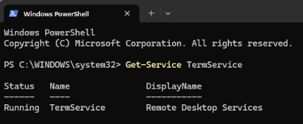

---

## 2. Verify RDP Firewall Rules

Windows Firewall rules for Remote Desktop were checked to confirm that the RDP service was allowed through the firewall.

The following rules were enabled:

- Remote Desktop - User Mode (TCP-In)
- Remote Desktop - User Mode (UDP-In)
- Remote Desktop - Shadow (TCP-In)

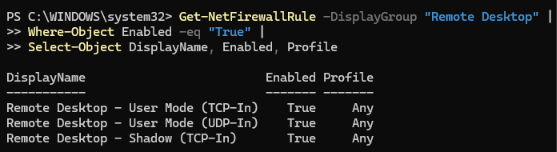

---

## 3. Verify RDP Port

The Windows endpoint was checked to confirm that TCP port 3389 was listening for Remote Desktop connections.

Command executed:

`Get-NetTCPConnection -LocalPort 3389 -State Listen`

The RDP service was successfully confirmed to be listening on port 3389.

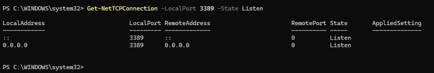

---

## 4. Test RDP Port Connectivity from Kali

Before establishing an RDP session, network-level connectivity to the Windows RDP service was tested from Kali Linux.

Command executed:

`nc -zv 192.168.56.102 3389`

The result showed:

`192.168.56.102 3389 (ms-wbt-server) open`

This confirmed that TCP port 3389 was reachable and that the Windows RDP service was accepting connections.

This command only tested network connectivity to the RDP port. It did not authenticate a user or establish an RDP session.

---

## 5. Verify the RDP Client

The FreeRDP client installed on Kali Linux was verified before establishing the remote session.

Command executed:

`xfreerdp --version`

The installed FreeRDP version was displayed successfully.

---

## 6. Establish the RDP Connection

After confirming network connectivity and verifying the RDP client, an actual RDP connection was initiated from Kali Linux to the Windows endpoint.

Command executed:

`xfreerdp /v:192.168.56.102 /u:vboxuser`

The `vboxuser` account was used for the Windows authentication.

This was the actual remote connection step, unlike the previous `nc` command which only tested port connectivity.

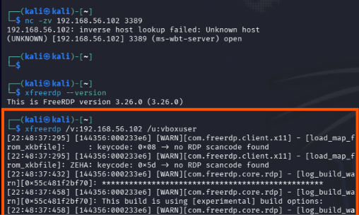

---

## 7. Establish the Remote Desktop Session

The RDP connection successfully opened a Windows desktop session from the Kali Linux environment.

The session was used to generate legitimate Windows authentication telemetry for SOC monitoring.

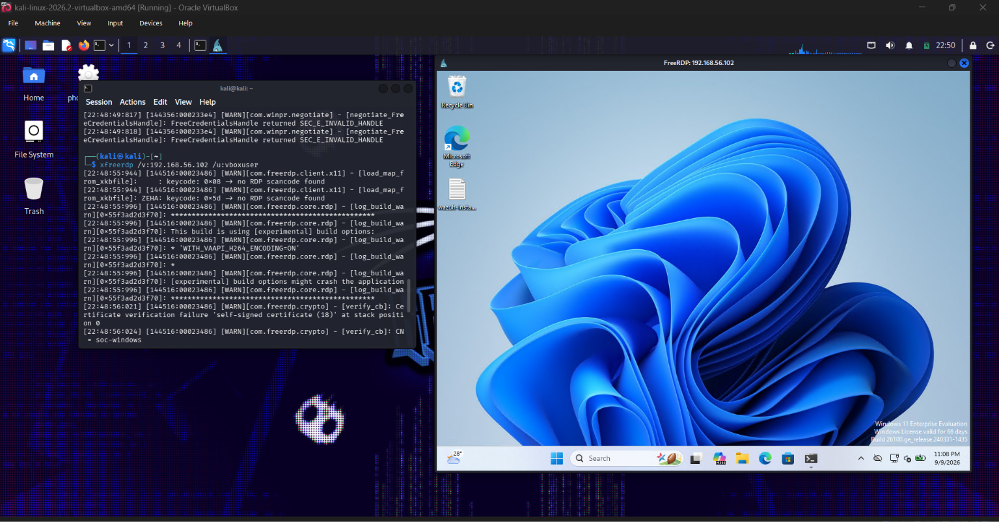

---

## 8. Hunt for Remote Interactive Authentication in Wazuh

After establishing the RDP session, Wazuh Threat Hunting was used to search for Windows authentication events with Logon Type 10.

The following filter was used:

`data.win.eventdata.logonType:10`

Wazuh returned matching events from the `SOC-WIN01` endpoint.

The relevant detection showed:

`User: WORKGROUP\vboxuser logged using Remote Desktop Connection (RDP)`

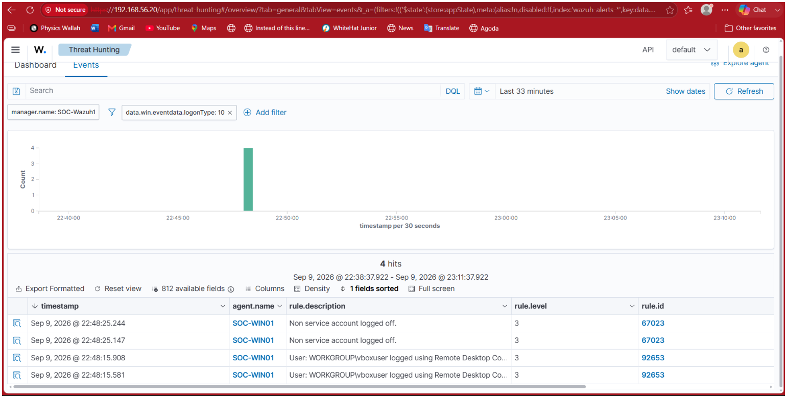

---

## 9. Investigate the Windows Authentication Event

The detected event was opened in Wazuh Document Details for detailed investigation.

Important fields identified from the event included:

| Field | Value |
|---|---|
| Windows Event ID | 4624 |
| Logon Type | 10 |
| Target Username | vboxuser |
| Source IP | 192.168.56.103 |
| Authentication Package | Negotiate |
| Logon Process | User32 |
| Channel | Security |
| Severity | AUDIT_SUCCESS |
| Workstation | SOC-WINDOWS |
| Agent | SOC-WIN01 |

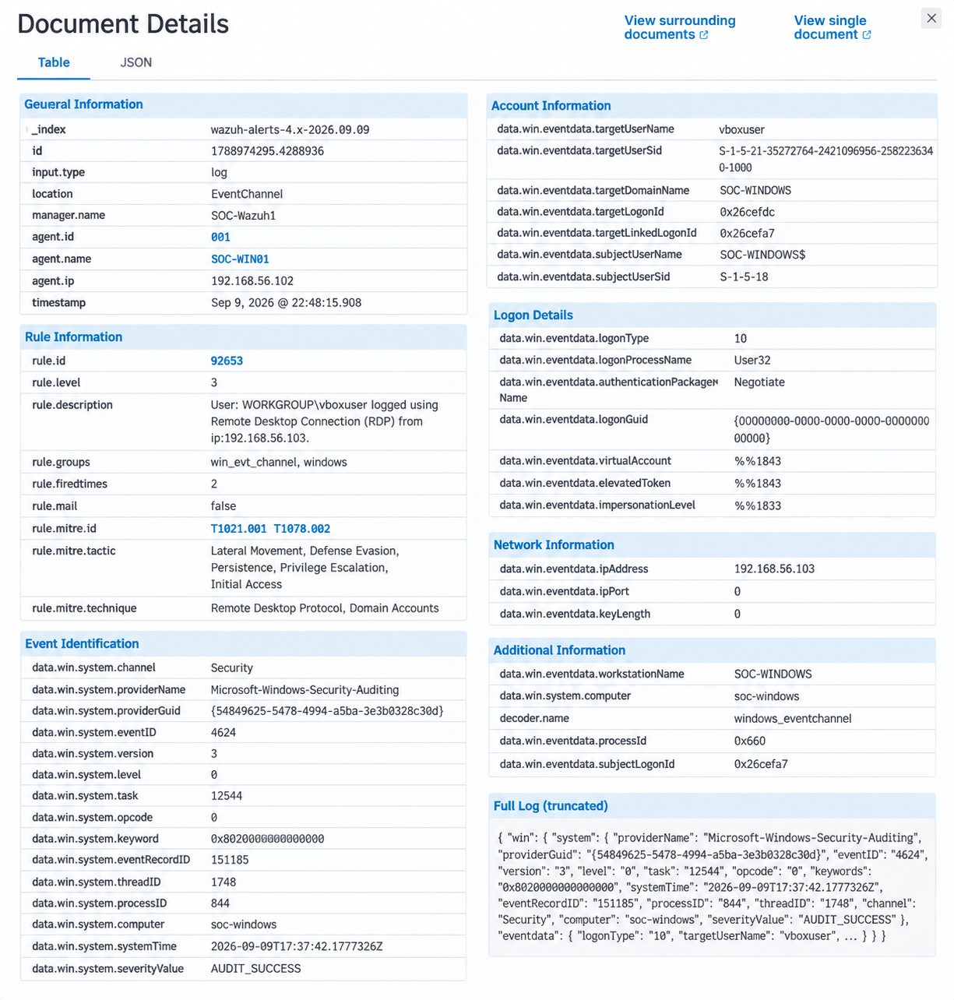

---

## 10. Confirm Logon Type 10

The Windows Security event confirmed:

- Event ID: `4624`
- Logon Type: `10`
- Target User: `vboxuser`
- Source IP: `192.168.56.103`

Logon Type 10 identifies a Remote Interactive authentication associated with Remote Desktop Services.

---

## 11. Wazuh Detection Rule

Wazuh generated Rule ID `92653`.

Detection description:

`User: WORKGROUP\vboxuser logged using Remote Desktop Connection (RDP) from ip:192.168.56.103.`

The Wazuh event also contained MITRE ATT&CK references:

- `T1021.001` — Remote Desktop Protocol
- `T1078.002` — Valid Accounts: Domain Accounts

---

## 12. Authentication Investigation Workflow

The complete investigation workflow was:

RDP Port Connectivity Test
→ FreeRDP Client Verification
→ RDP Connection
→ Windows Authentication
→ Windows Event ID 4624
→ Logon Type 10
→ User Identification
→ Source IP Identification
→ Wazuh Detection
→ MITRE ATT&CK Context
→ SOC Investigation

---

## Key Findings

- TCP port 3389 on the Windows endpoint was reachable from Kali.
- FreeRDP was available on the Kali system.
- An actual RDP connection was established using the `vboxuser` account.
- Windows generated a successful authentication event.
- Windows Event ID `4624` confirmed successful authentication.
- Logon Type `10` identified the authentication as Remote Interactive.
- The authenticated account was `vboxuser`.
- The Windows event recorded source IP `192.168.56.103`.
- Wazuh detected the activity using Rule ID `92653`.
- The Wazuh detection identified the activity as an RDP authentication.
- The event contained MITRE ATT&CK references.

---

## SOC Analyst Takeaway

A successful remote authentication should not automatically be considered malicious.

A SOC analyst should investigate the authentication context, including:

- Who authenticated?
- From where?
- When did the authentication occur?
- What logon type was used?
- Was RDP expected in the environment?
- Which authentication mechanism was used?
- What activity occurred after the login?
- Does the activity match expected behavior?

This practical demonstrates how a SOC analyst can move from network-level connectivity verification to actual remote authentication telemetry and finally investigate the resulting Windows event through Wazuh.

---

## Evidence

All practical screenshots are stored in:

`./screenshots/`

Evidence includes:

- `authentication-monitoring-practical-2-rdp-service.png`
- `authentication-monitoring-practical-2-rdp-firewall.png`
- `authentication-monitoring-practical-2-rdp-port.png`
- `authentication-monitoring-practical-2-rdp-connectivity.png`
- `authentication-monitoring-practical-2-rdp-client.png`
- `authentication-monitoring-practical-2-rdp-command.png`
- `authentication-monitoring-practical-2-rdp-session.png`
- `authentication-monitoring-practical-2-wazuh-detection.png`
- `authentication-monitoring-practical-2-event-details.png`
- `authentication-monitoring-practical-2-logon-type-10.png`
- `authentication-monitoring-practical-2-rule-mitre.png`

---

## Practical Status

**COMPLETED**

The practical successfully demonstrated the complete remote authentication monitoring workflow:

RDP Connectivity
→ RDP Client
→ Remote Desktop Session
→ Windows Authentication
→ Event ID 4624
→ Logon Type 10
→ Wazuh Detection
→ Event Investigation
→ MITRE ATT&CK Context
