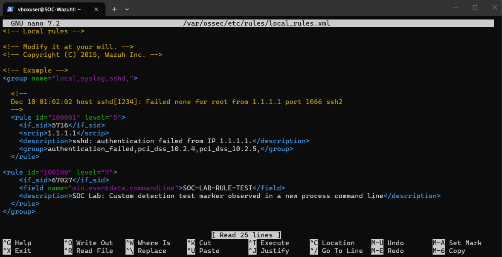
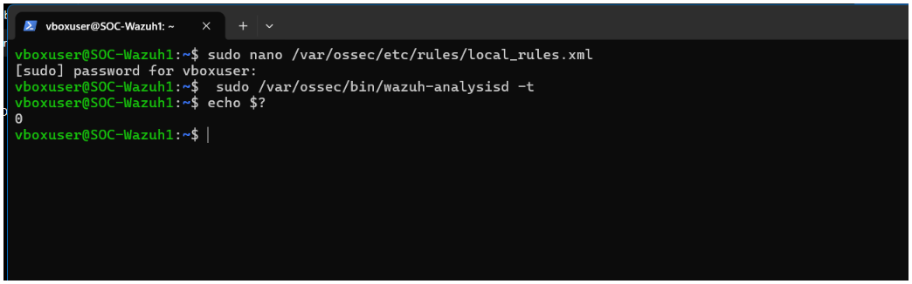
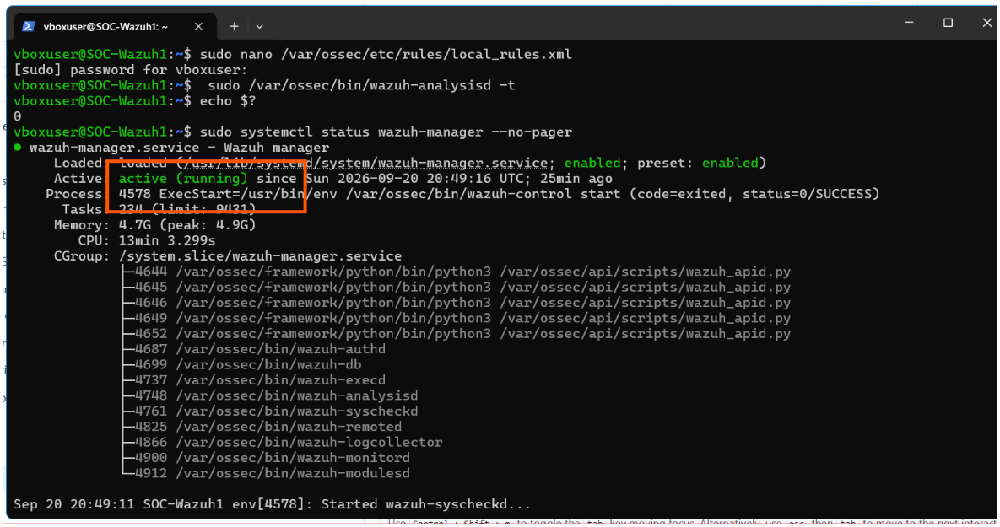
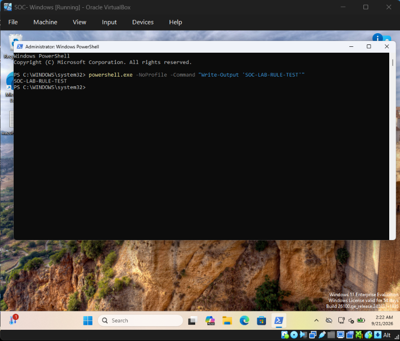
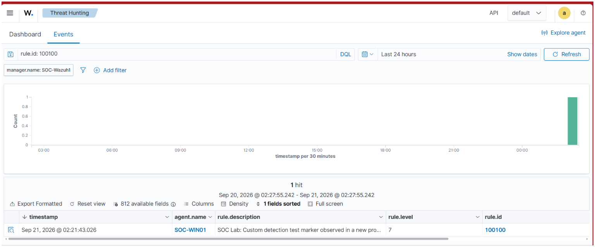
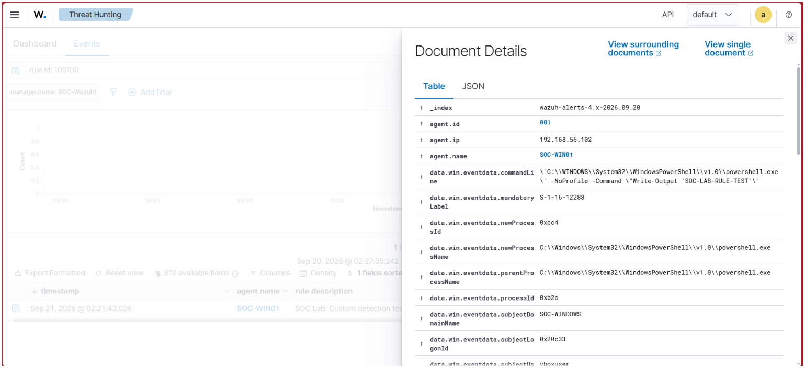
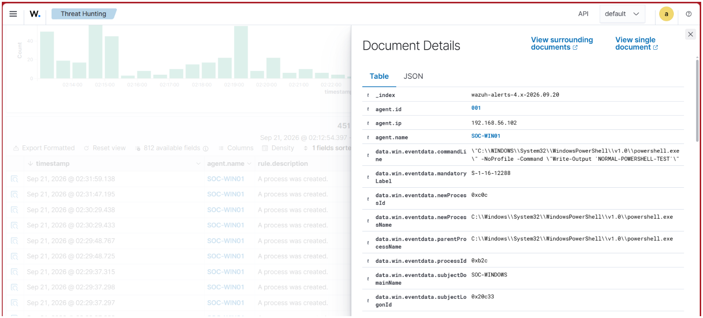
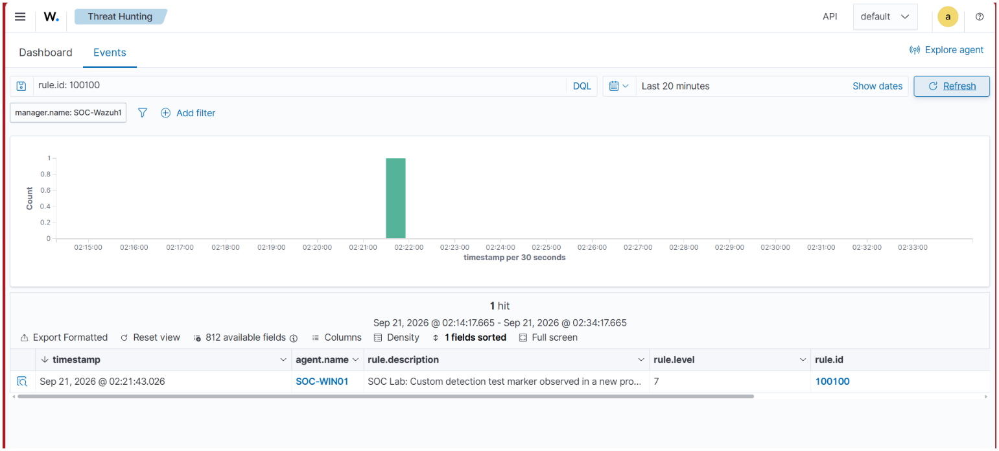

# 11 — Detection Engineering

## Objective

This section focused on creating and validating a custom Wazuh detection rule.

Instead of relying only on built-in Wazuh detections, a custom rule was created for this lab and tested against both matching and non-matching activity.

The main goal was to verify the complete detection-engineering workflow:

    Detection Requirement
            ↓
    Custom Wazuh Rule
            ↓
    Rule Validation
            ↓
    Test Activity
            ↓
    Alert Generation
            ↓
    Investigation
            ↓
    Negative Test
            ↓
    Detection Validation

---

## Lab Environment

| Component | Details |
|---|---|
| SOC Server | Ubuntu + Wazuh |
| Windows Endpoint | SOC-WIN01 |
| Windows IP | 192.168.56.102 |
| Wazuh Manager | SOC-Wazuh1 |
| Detection Type | Custom Wazuh Rule |
| Custom Rule ID | 100100 |
| Base Rule | 67027 |
| Custom Rule Level | 7 |

---

# 1. Detection Requirement

The objective was to create a custom detection for a specific lab marker appearing in a newly created process command line.

The marker used for the test was:

    SOC-LAB-RULE-TEST

The existing Wazuh process creation rule was used as the starting point:

    Rule 67027
    A process was created.

The custom rule was designed to look for the test marker within the process command line.

---

# 2. Create the Custom Detection Rule

The Wazuh local rules file was opened on the SOC server:

    sudo nano /var/ossec/etc/rules/local_rules.xml

The custom rule was added inside the existing local rule group.

The rule configuration used was:

    <rule id="100100" level="7">
      <if_sid>67027</if_sid>
      <field name="win.eventdata.commandLine">SOC-LAB-RULE-TEST</field>
      <description>SOC Lab: Custom detection test marker observed in a new process command line</description>
    </rule>

### Rule Logic

    Existing Rule 67027
            ↓
    New process created
            ↓
    Check command line
            ↓
    Contains SOC-LAB-RULE-TEST?
            ↓
          YES
            ↓
    Custom Rule 100100
            ↓
        Level 7 Alert

The rule was intentionally tied to the existing process-creation detection so that the custom logic only evaluated relevant process events.

### Evidence

---

# 3. Validate the Wazuh Configuration

Before restarting the Wazuh manager, the configuration was tested using:

    sudo /var/ossec/bin/wazuh-analysisd -t

The command returned exit code:

    0

This confirmed that the Wazuh analysis configuration loaded without a configuration error.

### Evidence

---

# 4. Restart the Wazuh Manager

After the configuration test passed, the Wazuh manager was restarted:

    sudo systemctl restart wazuh-manager

The service status was then checked:

    sudo systemctl status wazuh-manager --no-pager

The manager was confirmed to be:

    Active: active (running)

This confirmed that the updated rule configuration was loaded by the running Wazuh manager.

### Evidence

---

# 5. Generate Controlled Test Activity

A harmless PowerShell command was executed on `SOC-WIN01` to create a new PowerShell process containing the custom detection marker:

    powershell.exe -NoProfile -Command "Write-Output 'SOC-LAB-RULE-TEST'"

The command produced:

    SOC-LAB-RULE-TEST

This generated a Windows process creation event that could be evaluated by the custom rule.

### Evidence

---

# 6. Verify the Custom Alert in Wazuh

After generating the test activity, Wazuh Threat Hunting was used to search for:

    rule.id: 100100

The custom alert was found successfully.

The Wazuh event showed:

| Field | Value |
|---|---|
| Agent | SOC-WIN01 |
| Rule ID | 100100 |
| Rule Level | 7 |
| Detection | SOC Lab: Custom detection test marker observed in a new process command line |

### Evidence

---

# 7. Investigate the Custom Alert

The alert was opened in Wazuh Document Details.

The event showed the process and command line that triggered the custom rule.

The command line contained:

    powershell.exe -NoProfile -Command "Write-Output 'SOC-LAB-RULE-TEST'"

The event also identified the Windows endpoint and process-related fields associated with the event.

### Evidence

This confirmed that the custom rule was not only loaded but actually matched the expected process telemetry.

---

# 8. Positive Detection Test

The positive test produced the expected result:

    Test Marker:
    SOC-LAB-RULE-TEST

            ↓

    Windows Process Creation

            ↓

    Rule 67027

            ↓

    Custom Condition Matched

            ↓

    Rule 100100

            ↓

    Level 7 Alert

This demonstrated that the custom rule successfully detected the intended activity.

---

# 9. Negative Detection Test

A second PowerShell process was created without the custom marker:

    powershell.exe -NoProfile -Command "Write-Output 'NORMAL-POWERSHELL-TEST'"

This activity still generated normal process-creation telemetry, but it did not contain the string:

    SOC-LAB-RULE-TEST

The event was visible as a normal process creation event.

### Evidence

---

# 10. Verify the Negative Result

The Wazuh Threat Hunting view was checked again using:

    rule.id: 100100

No new custom Rule 100100 alert was generated for the normal PowerShell test.

The previously generated custom alert remained the only matching event.

### Evidence

This confirmed that the custom detection was not triggered simply because PowerShell was executed.

---

# 11. Detection Validation

The custom rule was therefore tested in both directions.

### Positive Test

    SOC-LAB-RULE-TEST

    → Rule 100100 FIRED

### Negative Test

    NORMAL-POWERSHELL-TEST

    → Rule 100100 DID NOT FIRE

This is important because a detection rule should be tested not only for what it catches, but also for what it intentionally ignores.

---

# 12. Detection Engineering Workflow

The completed workflow was:

    Detection Requirement
            ↓
    Identify Existing Base Rule
            ↓
    Create Custom Rule
            ↓
    Validate Configuration
            ↓
    Restart Wazuh Manager
            ↓
    Generate Controlled Activity
            ↓
    Confirm Custom Alert
            ↓
    Investigate Alert
            ↓
    Generate Non-Matching Activity
            ↓
    Verify No Custom Alert
            ↓
    Detection Validated

---

# 13. SOC Analyst Interpretation

The purpose of the custom rule was not to classify every PowerShell execution as suspicious.

Instead, the rule was created around a specific condition and tested against both matching and non-matching process activity.

This demonstrates a basic detection-engineering principle:

    Broad telemetry
          ↓
    Specific detection condition
          ↓
    Useful alert
          ↓
    Investigation

A detection that fires on everything can create unnecessary alert volume. Testing both positive and negative cases helps verify that the intended detection logic is actually working as designed.

---

# 14. Detection Rule Breakdown

| Component | Purpose |
|---|---|
| Rule ID `100100` | Unique custom rule identifier |
| Level `7` | Alert level assigned to the custom detection |
| `if_sid 67027` | Uses the existing process-creation detection as the base |
| `commandLine` field | Examines the process command line |
| `SOC-LAB-RULE-TEST` | Controlled test marker |
| Description | Identifies what the custom rule detects |

---

# 15. Key Concepts Learned

### Built-in Rule

Wazuh already contains detection logic such as:

    Rule 67027
    A process was created.

### Custom Rule

The lab added a custom detection:

    Rule 100100
    SOC Lab: Custom detection test marker observed in a new process command line

### Positive Testing

Confirms that the rule fires when its conditions are met.

### Negative Testing

Confirms that unrelated activity does not trigger the custom rule.

### Detection Validation

A rule should be checked at both the configuration level and the alert level.

---

# 16. Evidence

All screenshots for this section are stored in:

    ./screenshots/

The evidence files are:

    11-01-custom-rule-configuration.png
    11-01-wazuh-rule-validation.png
    11-01-wazuh-manager-running.png
    11-01-custom-detection-test.png
    11-01-custom-rule-alert-overview.png
    11-01-custom-rule-alert-details.png
    11-01-custom-rule-negative-test.png
    11-01-custom-rule-negative-result.png

---

# 17. Detection Summary

| Test | Expected Result | Actual Result |
|---|---|---|
| Custom marker present | Rule 100100 should fire | ✅ Fired |
| Custom marker absent | Rule 100100 should not fire | ✅ Did not fire |
| Wazuh configuration validation | No configuration error | ✅ Passed |
| Wazuh manager restart | Service running | ✅ Running |
| Alert investigation | Triggering command visible | ✅ Verified |

---

# Conclusion

This practical demonstrated the basic detection-engineering workflow in Wazuh.

A custom Rule `100100` was created using the existing process-creation Rule `67027` as its base. The configuration was validated successfully and the Wazuh manager restarted without errors.

A controlled PowerShell process containing `SOC-LAB-RULE-TEST` triggered the custom rule and generated a Level 7 alert.

A second PowerShell process using `NORMAL-POWERSHELL-TEST` generated normal process telemetry but did not trigger the custom rule.

The final workflow was:

    Create Detection
          ↓
    Validate Configuration
          ↓
    Generate Matching Activity
          ↓
    Detect
          ↓
    Investigate
          ↓
    Generate Non-Matching Activity
          ↓
    Confirm No False Match
          ↓
    Detection Validated

This practical demonstrates the difference between collecting telemetry and engineering a specific detection from that telemetry.
