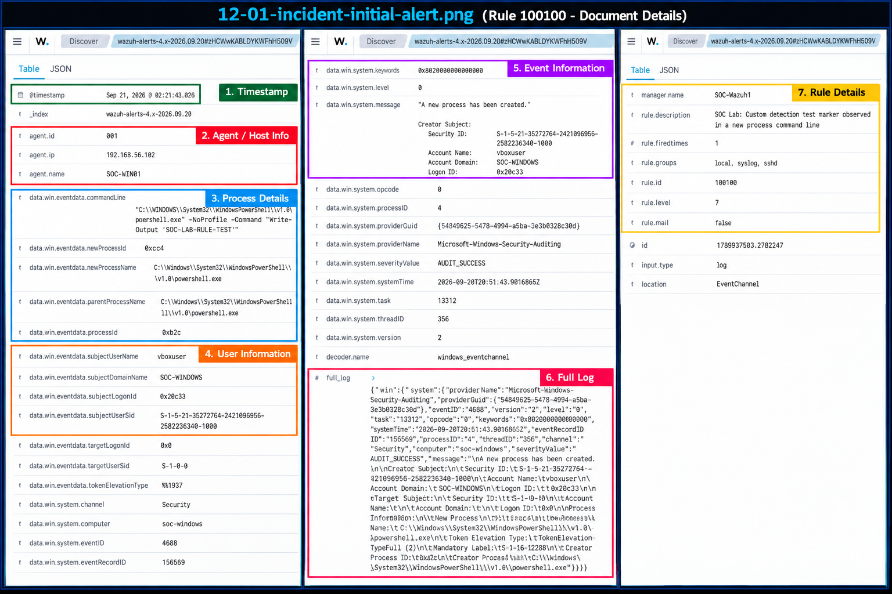
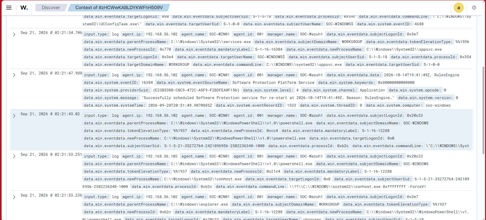
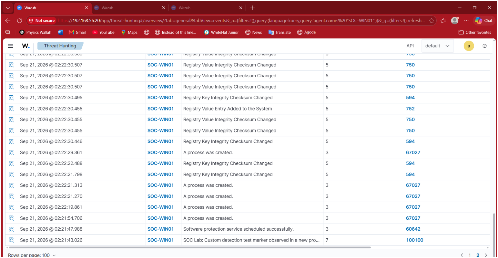
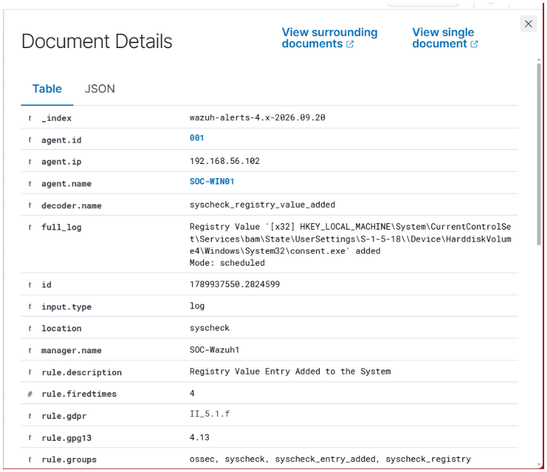
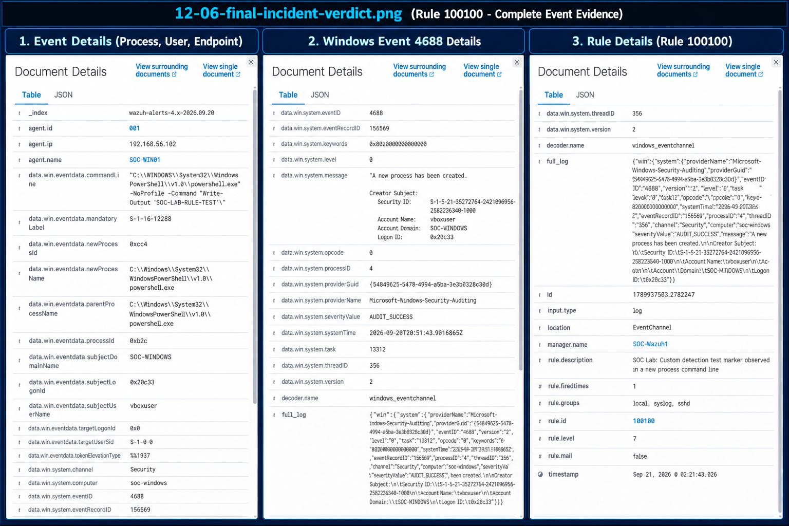

# 12 — Incident Investigation

## Objective

The objective of this section was to investigate a Wazuh alert from start to finish instead of looking at the alert as an isolated event.

The investigation started from a custom Wazuh detection and followed the activity through:

- Initial alert investigation
- Timeline reconstruction
- Process and user analysis
- Related event review
- Scope analysis
- Root cause analysis
- Final incident verdict

The main goal was to practice how a SOC analyst moves from an alert to an evidence-based conclusion.

---

## Lab Environment

| Component | Details |
|---|---|
| SOC Server | Ubuntu + Wazuh |
| Wazuh Manager | SOC-Wazuh1 |
| Windows Endpoint | SOC-WIN01 |
| Windows IP | 192.168.56.102 |
| User | vboxuser |
| Initial Detection | Custom Wazuh Rule 100100 |
| Base Detection | Rule 67027 |
| Windows Event | 4688 |
| Activity | Controlled PowerShell test |

---

# 1. Initial Alert

The incident investigation started with a custom Wazuh Rule 100100 alert.

The alert was generated after a controlled PowerShell command was executed on `SOC-WIN01`.

The detected activity contained the custom lab marker:

    SOC-LAB-RULE-TEST

The initial alert showed:

    Rule ID:
    100100

    Rule Level:
    7

    Endpoint:
    SOC-WIN01

    User:
    vboxuser

    Event:
    Windows Process Creation

### Evidence

This screenshot captures the initial Wazuh alert and the underlying Windows process-creation telemetry.

---

# 2. Initial Alert Investigation

The Rule 100100 alert was opened in Wazuh Document Details.

The event showed that the custom detection was associated with a Windows process creation event.

Important information identified during the investigation included:

    Agent:
    SOC-WIN01

    User:
    vboxuser

    Process:
    powershell.exe

    Command Line:
    powershell.exe -NoProfile -Command "Write-Output 'SOC-LAB-RULE-TEST'"

    Windows Event:
    4688

    Custom Rule:
    100100

The alert was treated as the starting point of the investigation rather than the final conclusion.

---

# 3. Timeline Reconstruction

The surrounding events around the alert timestamp were reviewed in Wazuh Threat Hunting.

The main custom detection occurred at:

    Sep 21, 2026 @ 02:21:43.026

Nearby telemetry included additional process creation events and registry-related events.

The timeline was reviewed to determine whether the surrounding events were actually related to the initial detection.

### Evidence

This screenshot shows the surrounding activity observed around the time of the custom detection.

---

# 4. Process Activity Correlation

The process activity was reviewed to understand the event that triggered the custom detection.

The relevant process information was:

    Process:
    powershell.exe

    Command Line:
    powershell.exe -NoProfile -Command "Write-Output 'SOC-LAB-RULE-TEST'"

    User:
    vboxuser

    Windows Event ID:
    4688

The custom rule was based on the existing process-creation detection.

The relationship was:

    Windows Process Creation
            ↓
    Rule 67027
            ↓
    Command Line Inspection
            ↓
    SOC-LAB-RULE-TEST
            ↓
    Custom Rule 100100
            ↓
    Level 7 Alert

The original Rule 100100 Document Details already contained the underlying Windows Event ID 4688 information, so a separate base-rule screenshot was not required.

---

# 5. Scope Analysis

The events around the incident were reviewed to determine the scope of the activity.

The investigation focused on:

- Affected endpoint
- User involved
- Process involved
- Related activity
- Additional endpoints
- Related registry activity

The known incident scope was:

    Endpoint:
    SOC-WIN01

    User:
    vboxuser

    Main Process:
    powershell.exe

    Custom Detection:
    Rule 100100

### Evidence

This screenshot shows the surrounding telemetry reviewed during the scope analysis.

---

# 6. Related Registry Activity Review

During the timeline review, a Wazuh Rule 752 registry event was observed at approximately:

    02:22:30.455

The event showed:

    Rule:
    752

    Description:
    Registry Value Entry Added to the System

    Decoder:
    syscheck_registry_value_added

The registry activity involved a different Windows registry location associated with `consent.exe`.

The investigation did not establish that this registry modification was caused by the custom PowerShell test.

Therefore, the event was treated as related telemetry that was reviewed but not attributed to the incident without supporting evidence.

### Evidence

This screenshot shows the registry event that was reviewed during the investigation.

---

# 7. Root Cause Analysis

The root cause of the Rule 100100 alert was established from the controlled lab activity.

The test sequence was:

    User intentionally executed the test command
            ↓
    PowerShell process was created
            ↓
    Windows generated Event ID 4688
            ↓
    Rule 67027 identified the process creation
            ↓
    Command line matched SOC-LAB-RULE-TEST
            ↓
    Custom Rule 100100 fired
            ↓
    Wazuh generated the alert

The alert was therefore generated by the controlled test activity used for this lab.

---

# 8. Impact and Scope Assessment

The investigation established the following known scope:

| Item | Finding |
|---|---|
| Endpoint | SOC-WIN01 |
| User | vboxuser |
| Main Process | powershell.exe |
| Event | Windows Event ID 4688 |
| Custom Detection | Rule 100100 |
| Test Marker | SOC-LAB-RULE-TEST |
| Additional Endpoint Impact Established | No |

The investigation did not establish evidence that the custom test affected another endpoint.

The registry activity observed later in the timeline was investigated separately and was not attributed to the custom test.

---

# 9. Final Incident Verdict

The final verdict for this laboratory incident was:

    AUTHORIZED / BENIGN LAB ACTIVITY

Reasoning:

    Controlled test activity
            ↓
    Known user
            ↓
    Known endpoint
            ↓
    Known PowerShell command
            ↓
    Expected Windows Event 4688
            ↓
    Expected custom Wazuh Rule 100100
            ↓
    Investigation completed
            ↓
    No evidence of malicious intent established

This verdict is based on the controlled nature of the activity performed in the home lab.

### Evidence

This screenshot provides the final investigation evidence used to document the incident conclusion.

---

# 10. Investigation Workflow

The complete incident investigation workflow was:

    Alert
        ↓
    Initial Triage
        ↓
    Document Details
        ↓
    Identify User
        ↓
    Identify Process
        ↓
    Identify Command Line
        ↓
    Reconstruct Timeline
        ↓
    Review Related Events
        ↓
    Analyze Scope
        ↓
    Determine Root Cause
        ↓
    Assess Impact
        ↓
    Final Verdict
        ↓
    Document Findings

---

# 11. SOC Analyst Questions Answered

### Who?

    vboxuser

### What happened?

A controlled PowerShell process was created and triggered the custom Wazuh detection.

### When?

    Sep 21, 2026 @ 02:21:43.026

### Where?

    SOC-WIN01

### How?

The PowerShell command contained the custom detection marker:

    SOC-LAB-RULE-TEST

### Why did the alert fire?

The command line matched the condition defined in custom Rule 100100.

### Was it malicious?

The activity was intentionally generated as part of the home lab and was classified as authorized laboratory activity.

---

# 12. Evidence-Based Investigation

A key part of the investigation was separating confirmed evidence from assumptions.

The investigation confirmed:

    PowerShell process creation
    +
    Known user
    +
    Known endpoint
    +
    Known command line
    +
    Custom rule match

The investigation also reviewed nearby registry activity but did not assume that it was part of the same incident without evidence.

This prevented unrelated telemetry from being incorrectly attributed to the incident.

---

# 13. Key Investigation Skills Demonstrated

This practical demonstrated:

- Alert triage
- Document Details investigation
- Process analysis
- Command-line analysis
- Timeline reconstruction
- Event correlation
- Scope analysis
- Root cause analysis
- Evidence-based classification
- Incident documentation

---

# 14. Detection-to-Investigation Flow

    Wazuh Alert
          ↓
    Rule 100100
          ↓
    Windows Event 4688
          ↓
    PowerShell Process
          ↓
    Command-Line Analysis
          ↓
    Timeline Review
          ↓
    Related Event Review
          ↓
    Scope Analysis
          ↓
    Root Cause
          ↓
    Final Verdict

---

# 15. Evidence Files

All evidence screenshots are stored in:

    ./screenshots/

The screenshots used in this section are:

    12-01-incident-initial-alert.png
    12-02-incident-timeline.png
    12-04-incident-scope-analysis.png
    12-05-related-registry-event.png
    12-06-final-incident-verdict.png

---

# 16. Detection Summary

| Investigation Stage | Result |
|---|---|
| Initial alert identified | ✅ |
| Alert details investigated | ✅ |
| User identified | ✅ |
| Process identified | ✅ |
| Command line identified | ✅ |
| Windows Event 4688 identified | ✅ |
| Timeline reconstructed | ✅ |
| Surrounding events reviewed | ✅ |
| Related registry activity investigated | ✅ |
| Incident scope assessed | ✅ |
| Root cause established | ✅ |
| Final verdict established | ✅ |

---

# Conclusion

This exercise demonstrated how a SOC analyst can investigate a security alert from the initial detection through to a final evidence-based conclusion.

The investigation started with custom Wazuh Rule 100100 and identified a PowerShell process created under `vboxuser` on `SOC-WIN01`.

The surrounding activity was reviewed to build a timeline and determine whether other events were related. A registry modification was investigated separately and was not attributed to the PowerShell test because supporting evidence was not established.

The root cause of the alert was confirmed as the intentional execution of the controlled PowerShell test command containing `SOC-LAB-RULE-TEST`.

The final incident verdict was:

    AUTHORIZED / BENIGN LAB ACTIVITY

The overall SOC investigation process was:

    Detect
        ↓
    Triage
        ↓
    Investigate
        ↓
    Correlate
        ↓
    Assess Scope
        ↓
    Determine Root Cause
        ↓
    Reach Evidence-Based Verdict
        ↓
    Document

This practical demonstrates the transition from simply receiving a Wazuh alert to actually investigating and explaining what happened.
